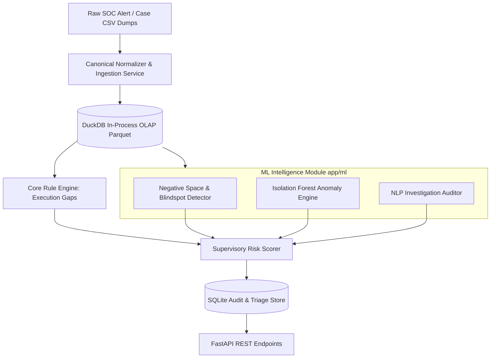

# Orion (SAT-SA) — Backend Architecture Document

**System**: Supervisory Analytics Tool for SOC Assessment (SAT-SA) for NCIIPC  
**Application**: Orion Core Backend & ML Intelligence Engine  
**Tech Stack**: Python 3.11+ • FastAPI • DuckDB / Polars • SQLite (WAL Mode) • Scikit-learn • Pydantic v2

---

## 1. Architectural Philosophy & Air-Gapped Constraints

1. **Strictly Offline & Air-Gapped**: Zero external dependencies at runtime. No calls to cloud APIs, OpenAI/external LLMs, or CDN asset hosts. All models and tokenizers run strictly on local CPU/RAM.
2. **Dual-Tier Storage Strategy**:
   - **SQLite (WAL Mode)**: Lightweight transactional store for entity registries, examiner findings, supervisory reports, user state, and audit logs.
   - **DuckDB / Polars**: Embedded in-process columnar analytical engine. Executes sub-second aggregations, temporal window functions, and multi-entity cross-tabulations across 500,000+ SOC alert records without needing an external database server like Postgres or ClickHouse.
3. **Decoupled Modular Architecture**: Clean interface separation between the **Core Backend Service** (`app/api`, `app/db`, `app/services`) and the **ML Intelligence Module** (`app/ml`).
4. **Deterministic Auditability + Probabilistic Explainability**: Every flagged finding has a transparent mathematical and rule-based justification.

---

## 2. Directory Layout & Module Structure

```text
backend/
├── app/
│   ├── main.py                        # FastAPI entry point, CORS, lifecycle hooks
│   ├── config.py                      # Application settings (DB paths, seed configs)
│   ├── api/
│   │   └── v1/
│   │       ├── router.py              # Main API v1 aggregator router
│   │       ├── endpoints/
│   │       │   ├── entities.py        # /api/v1/entities (CSE listing, risk rankings, peer comparison)
│   │       │   ├── triage.py          # /api/v1/triage (Smart sampling queue, flagged samples)
│   │       │   ├── findings.py        # /api/v1/findings (Drill-down evidence, examiner notes)
│   │       │   ├── ingestion.py       # /api/v1/ingest (Batch CSV/JSON upload, validation)
│   │       │   ├── benchmarks.py      # /api/v1/benchmarks (Sector baselines & radar metrics)
│   │       │   └── reports.py         # /api/v1/reports (Supervisory dossier generation & export)
│   ├── db/
│   │   ├── sqlite.py                  # SQLite connection pool & session manager
│   │   ├── duckdb_client.py           # DuckDB in-process OLAP query manager
│   │   └── models.py                  # SQLAlchemy / SQLModel schema definitions
│   ├── schemas/                       # Pydantic v2 Request/Response validation schemas
│   │   ├── entity.py
│   │   ├── triage.py
│   │   ├── ingestion.py
│   │   └── finding.py
│   ├── services/                      # Core backend business logic
│   │   ├── ingestion_service.py       # Normalizes incoming CSV/JSON to canonical schema
│   │   ├── rules_engine.py            # Deterministic Execution Gap rule evaluator
│   │   ├── risk_scorer.py             # Combines rule violations + ML scores into 0-100 index
│   │   └── report_generator.py        # Compiles structured NCIIPC assessment dossier
│   └── ml/                            # [ML Dev Ownership] Pure Python intelligence package
│       ├── __init__.py
│       ├── dataset_generator.py       # Generates realistic synthetic multi-entity benchmark datasets
│       ├── negative_space.py          # Statistical telemetry divergence & ATT&CK blindspot detector
│       ├── anomaly_engine.py          # Isolation Forest & outlier scoring for metric gaming
│       ├── nlp_auditor.py             # Offline TF-IDF + Cosine similarity template investigation detector
│       └── pipeline.py                # Unified ML supervisory pipeline runner
├── data/
│   ├── seed/                          # Bundled synthetic CSE datasets (Alpha, Beta, Gamma)
│   ├── sqlite/                        # Local SQLite DB files (orion.db)
│   └── parquet/                       # Columnar storage for ingested entity alerts/cases
├── tests/
│   ├── test_rules.py
│   ├── test_ml_pipeline.py
│   └── test_ingestion.py
├── requirements.txt                   # Frozen offline dependencies
└── run.py                             # Uvicorn dev runner
```

---

## 3. Canonical Data Schema (Normalized Supervisory Model)

All disparate entity formats (Splunk, Elastic, ServiceNow, QRadar dumps) are normalized into four standard schemas stored in DuckDB and SQLite:

### 3.1 `Entity` (Critical Sector Entity)
- `entity_id`: String (e.g. `CSE-ALPHA-POWER`)
- `name`: String (e.g. `National Power Grid Corp`)
- `sector`: Enum (`Energy`, `Banking`, `Telecom`, `Transport`, `Government`)
- `critical_asset_count`: Integer
- `created_at`: Datetime

### 3.2 `AlertRecord` (Normalized Operational Alert)
- `alert_id`: String (Unique)
- `entity_id`: Foreign Key
- `timestamp`: Datetime
- `title`: String
- `severity`: Enum (`CRITICAL`, `HIGH`, `MEDIUM`, `LOW`, `INFO`)
- `mitre_tactic`: String (e.g. `Lateral Movement`, `Exfiltration`, `Persistence`)
- `mitre_technique_id`: String (e.g. `T1021`, `T1059`)
- `source_ip`: String
- `destination_asset_id`: String
- `asset_criticality`: Enum (`CROWN_JEWEL`, `CRITICAL`, `STANDARD`, `LOW`)
- `status`: String (`CLOSED`, `ESCALATED`, `IN_PROGRESS`)

### 3.3 `CaseRecord` (Investigation & Case Management)
- `case_id`: String
- `entity_id`: Foreign Key
- `associated_alert_ids`: List[String]
- `created_at`: Datetime
- `closed_at`: Datetime
- `investigation_duration_sec`: Integer (`closed_at - created_at`)
- `analyst_id`: String
- `escalation_level`: Enum (`TIER_1`, `TIER_2`, `TIER_3`, `CISO_ESCALATED`, `NONE`)
- `disposition`: Enum (`TRUE_POSITIVE`, `FALSE_POSITIVE`, `BENIGN_ANOMALY`, `SUPPRESSED`)
- `investigation_notes`: String (Analyst narrative / investigation steps)
- `root_cause_action`: String

---

## 4. Analytical & ML Engines



### 4.1 Deterministic Execution Gap Rule Engine (`services/rules_engine.py`)
Computes unambiguous regulatory breaches:
1. **Rule EG-01: Rapid Case Closure**: High/Critical alert cases closed in `< 180 seconds` without Tier-2/Tier-3 escalation.
2. **Rule EG-02: Critical Suppression**: Critical severity alert closed as "False Positive" with `< 20 words` in investigation notes.
3. **Rule EG-03: Off-Hours Batch Closure**: Single analyst closing `> 25 cases` in a 30-minute window during shift handover.
4. **Rule EG-04: Crown Jewel Alert Downgrade**: Alert on designated Crown Jewel asset manually downgraded in severity without documentation.
5. **Rule EG-05: Repeat Incident Blindspot**: Alert with identical signature triggering `> 5 times` on the same host across 14 days without remediation ticket.

### 4.2 Negative Space Engine (`app/ml/negative_space.py`)
Uncovers the *absence of expected evidence*:
1. **Asset Telemetry Vacuum**: Computes `observed_alert_count` for all designated Crown Jewel assets. Assets with 0 alerts across a 90-day window in an active entity are flagged for logging blindspots.
2. **MITRE ATT&CK Matrix Divergence**: Evaluates observed technique distribution against peer sector medians. Flagging missing critical phases (e.g., zero alerts in Lateral Movement or Privilege Escalation while high volumes in Initial Access).
3. **Temporal Inactivity Anomalies**: Detects abnormal dips in SOC telemetry during specific shifts or weekends compared to continuous operations standards.

### 4.3 Outlier & Anomaly Detection (`app/ml/anomaly_engine.py`)
1. **Isolation Forest on Investigation Workflows**:
   - Feature vector: `[investigation_duration_log, step_count, notes_length, severity_weight, analyst_case_velocity]`.
   - Flags investigations that deviate drastically from natural operational behavior (e.g. suspiciously robotic velocity).
2. **Cross-Entity Peer Benchmarking**:
   - Calculates Z-Scores and Interquartile Ranges (IQR) for CSE metrics against the national sector median.

### 4.4 Local NLP Investigation Auditor (`app/ml/nlp_auditor.py`)
1. **Canned Template & Copy-Paste Detection**:
   - Computes TF-IDF vectorization across all investigation notes written by an analyst or entity.
   - Calculates pairwise cosine similarity. Clusters of notes with similarity `> 0.88` indicate superficial, template-driven investigation notes designed to meet metrics rather than investigate real threats.
2. **Substance Density Score**:
   - Analyzes technical token density (IPs, hashes, registry keys, process names) versus boilerplate stop-words.

---

## 5. API Endpoints Specification

| Method | Endpoint | Description |
|---|---|---|
| `GET` | `/api/v1/entities` | Lists all CSEs with supervisory risk index, execution gap & negative space scores |
| `GET` | `/api/v1/entities/{id}/summary` | Detailed scorecard, MITRE coverage heatmap, and peer comparison |
| `GET` | `/api/v1/triage` | Ranked supervisory triage queue of suspicious alert & case samples |
| `GET` | `/api/v1/triage/{id}/evidence` | Detailed drill-down for evidence drawer: timeline, rule triggers, NLP diff |
| `POST`| `/api/v1/ingest/upload` | Upload new batch CSV/JSON export for analysis |
| `POST`| `/api/v1/ingest/seed/{seed_id}` | Quick-load pre-seeded benchmark datasets (`alpha`, `beta`, `gamma`) |
| `GET` | `/api/v1/benchmarks` | Sector-wide baselines across Banking, Energy, and Telecom |
| `GET` | `/api/v1/reports/{entity_id}/export` | Compiles and generates official NCIIPC supervisory assessment dossier |

---

## 6. Execution & Performance Benchmarks

* **In-memory DuckDB queries**: Aggregate 500k alerts in `< 80ms`.
* **ML Pipeline Execution**: Isolation Forest + Negative Space + TF-IDF similarity across 50,000 cases runs in `< 4 seconds` on standard 4-core CPU without GPU requirement.
* **Offline Portability**: All libraries (`fastapi`, `duckdb`, `polars`, `scikit-learn`, `pydantic`) install cleanly offline from a pre-cached wheel directory or standard pip install.
