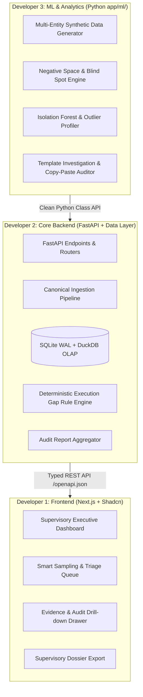

# Orion (SAT-SA) — Team Build Responsibilities & Work Breakdown

**Project**: Supervisory Analytics Tool for SOC Assessment (SAT-SA) for NCIIPC  
**Team Structure**: 3 Developers (1 Frontend, 1 Core Backend, 1 ML Backend)  
**Tech Stack**: Next.js 16 (App Router) + Shadcn UI + Tailwind CSS v4 | Python 3.11+ & FastAPI + DuckDB / SQLite + Scikit-learn / Polars

---

## 1. Executive Summary & Collaboration Contract

To ensure zero merge conflicts, parallel development velocity, and flawless integration during the hackathon, the project is decoupled across three strict boundaries:

---

## 2. Developer Roles & Milestone Ownership

### Developer 1: Frontend Lead (Next.js + Shadcn UI + Data Viz)
* **Primary Scope**: Design, implement, and polish the supervisory web application with rich visual aesthetics, dark-mode-first cyber-command aesthetics, high-density analytical tables, and interactive drill-downs.
* **Core Responsibilities**:
  1. **Design System & Shell**:
     - Modern cybersecurity / supervisory dark theme using Tailwind CSS v4, Lucide/Hugeicons, and Radix primitives (via Shadcn).
     - Global Navigation, Entity Selector, Time-Range Filter, and air-gapped system status indicators.
  2. **View 1: Executive CSE Overview & Peer Matrix**:
     - Multi-Entity Resilience Leaderboard (Supervisory Risk Index, Execution Gap Score, Negative Space Score).
     - Peer comparison radar charts (CSE vs Sector Benchmark).
     - Summary stat cards with anomaly indicators.
  3. **View 2: Supervisory Triage & Smart Sampling Queue**:
     - Sortable/filterable table of high-risk alert & case samples flagged for human examiner review.
     - Severity badges, anomaly confidence score, execution gap tags (`#MetricGaming`, `#RapidClosure`, `#MissingEscalation`).
  4. **View 3: Evidence Inspection & Explainability Drawer**:
     - Deep-dive slide-out drawer displaying case timelines, analyst response duration vs baseline, raw alert attributes, and template similarity score.
     - Explainability card showing *“Why Orion flagged this alert”* with traceable evidence pointers.
  5. **View 4: Entity Deep-Audit & Ingestion Hub**:
     - Detailed entity page with MITRE ATT&CK coverage heatmap showing monitored vs unmonitored techniques (Negative Space).
     - Ingestion upload manager with batch status and sample dataset switcher.
  6. **View 5: Supervisory Report & Dossier Generator**:
     - Printable / PDF-ready supervisory evaluation report compliant with NCIIPC examination requirements.
* **Deliverable Artifacts**:
  - `frontend/app/(dashboard)/...` routes and layouts.
  - `frontend/components/supervisory/...` reusable domain components.
  - `frontend/lib/api.ts` typed API client connecting to FastAPI backend.

---

### Developer 2: Core Backend Lead (FastAPI + Storage + Rule Engine)
* **Primary Scope**: Build the system backbone, canonical data schema, local persistent storage, ingestion pipelines, deterministic rule engine for regulatory execution gaps, and FastAPI REST endpoints.
* **Core Responsibilities**:
  1. **Database & Storage Architecture**:
     - Setup dual storage: **SQLite (WAL mode)** for relational operational state, audit cases, findings, and metadata; **DuckDB / Polars** for ultra-fast in-process analytical aggregations on alert/case dumps.
     - Implement SQLAlchemy / SQLModel schemas for `Entity`, `Alert`, `Case`, `InvestigationStep`, `Asset`, and `SupervisoryFinding`.
  2. **Canonical Data Ingestion & Normalizer Pipeline**:
     - Robust parser accepting CSV/JSON exports from disparate SOC/SIEM formats.
     - Column validation and normalization into Orion’s standard supervisory schema.
     - Background processing with ingestion progress and validation error reporting.
  3. **Deterministic Execution Gap Rule Engine**:
     - Rules for immediate regulatory non-compliance:
       - *Rapid Case Closure*: High/Critical severity cases closed in < 3 minutes without triage steps.
       - *Unescalated P1/P0 Alerts*: Severe threat categories closed without escalation to Tier-2/Tier-3.
       - *Off-Hours Bulk Closures*: Mass closures during shift handovers or off-hours without investigative notes.
       - *Asset Criticality Mismatch*: Crown Jewel asset alerts downgraded or closed without review.
       - *Recurring Unremediated Incidents*: Repeat alerts on the same IP/Host within 7 days.
  4. **Supervisory Scoring & Aggregation Service**:
     - Combine deterministic rule scores and ML anomaly scores into an **Entity Supervisory Risk Score (0–100)**.
     - Aggregation endpoints for sector benchmarks and trend analysis over time.
  5. **FastAPI Endpoints & Integration**:
     - Clean RESTful endpoints (`/api/v1/entities`, `/api/v1/triage`, `/api/v1/findings`, `/api/v1/ingest`, `/api/v1/reports`).
     - Auto-generated OpenAPI / Swagger specs for instant frontend consumption.
* **Deliverable Artifacts**:
  - `backend/app/main.py`, `backend/app/api/v1/...` routers.
  - `backend/app/db/` database initialization, migrations, and DuckDB analytical queries.
  - `backend/app/services/rules_engine.py` deterministic audit rules.
  - `backend/app/services/ingestion.py` CSV/JSON normalizer.

---

### Developer 3: ML & Data Science Lead (Analytics + Outliers + NLP + Datasets)
* **Primary Scope**: Build the offline intelligence layer in `backend/app/ml/`, unsupervised anomaly detection, negative space statistical models, local NLP for template-driven investigations, and synthetic benchmark datasets.
* **Core Responsibilities**:
  1. **Synthetic Multi-Entity Dataset Generation (Crucial for SIH Demo)**:
     - Generate realistic, synthetic multi-entity SOC dumps for 3–5 distinct CSEs:
       - **CSE-Alpha (Power Grid)**: Suffers from *Negative Space* (SCADA/OT crown jewel assets missing telemetry, zero lateral movement alerts, zero alerts on weekends).
       - **CSE-Beta (National Bank)**: Suffers from *Execution Gaps & Metric Gaming* (all alerts closed in under 2.5 minutes to hit SLA targets, canned template notes, critical alerts suppressed).
       - **CSE-Gamma (Telecom)**: Normal resilient baseline with mature escalation and investigation cycles.
     - Export as CSV/JSON pre-loaded into `backend/data/seed/`.
  2. **Negative Space & Blind Spot Analytics Engine**:
     - Expected Telemetry vs Observed Frequency statistical divergence.
     - Asset Coverage Gaps: Assets classified as high criticality with zero telemetry.
     - MITRE ATT&CK Matrix Blind Spot Detector: Identifies missing alert distributions compared to peer entity baselines.
  3. **Unsupervised Outlier & Anomaly Detection**:
     - **Isolation Forest / Local Outlier Factor (LOF)** to detect abnormal investigation durations, atypical closure codes, and anomalous analyst workloads.
     - Multi-Entity Peer Benchmarking (Z-Score & IQR cross-entity baseline deviations).
  4. **NLP Investigation Auditor (Template & Copy-Paste Detector)**:
     - Lightweight, fully offline NLP using TF-IDF vectorization and Cosine/Jaccard similarity.
     - Detect repetitive template-driven investigation notes and copy-paste investigations across multiple cases.
     - Calculate an *Investigation Substance Index* (information density vs boilerplate).
  5. **Clean Python API Delivery**:
     - Package all models into isolated, cleanly callable classes with typed inputs/outputs:
       - `ExecutionGapDetector`
       - `NegativeSpaceDetector`
       - `NLPInvestigationAuditor`
       - `SyntheticDataGenerator`
* **Deliverable Artifacts**:
  - `backend/app/ml/dataset_generator.py`
  - `backend/app/ml/negative_space.py`
  - `backend/app/ml/anomaly_engine.py`
  - `backend/app/ml/nlp_auditor.py`
  - Unit test / standalone CLI script `python -m app.ml.test_ml_pipeline` validating results offline.

---

## 3. Team Collaboration Timeline & Milestones

| Phase | Duration | Frontend Dev (Dev 1) | Core Backend Dev (Dev 2) | ML Backend Dev (Dev 3) |
|---|---|---|---|---|
| **Phase 1: Foundation** | Hours 0–6 | Build app shell, layout, mock data state, theme, navigation | Setup FastAPI, SQLite + DuckDB schema, Pydantic models, sample endpoint | Generate synthetic CSE datasets (Alpha, Beta, Gamma) in CSV/JSON |
| **Phase 2: Core Build** | Hours 6–18 | Executive Dashboard, Peer Benchmark radar, Triage Table | CSV Ingestion normalizer, Ingest seed datasets, Rule engine logic | Build Negative Space engine, Isolation Forest model, and NLP similarity pipeline |
| **Phase 3: Integration** | Hours 18–26 | Connect Next.js to FastAPI `/api/v1/*`, build Evidence Drawer | Integrate `app/ml` classes into FastAPI service, compute entity risk scores | Tune model thresholds, calibrate risk weights, verify offline execution |
| **Phase 4: Polish & Demo** | Hours 26–36 | Dossier Export, animations, drill-down polish, zero-state UX | Benchmark query optimization, error handling, Docker/local script | Validate NCIIPC evaluation criteria, generate demo screenshots & charts |
