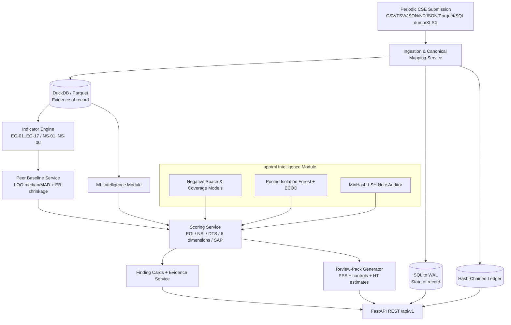

# Orion (SAT-SA) — Backend Architecture (v2)

**System**: Supervisory Analytics Tool for SOC Assessment (SAT-SA) for NCIIPC
**Application**: Orion Core Backend & ML Intelligence Engine
**Stack**: Python 3.11 • FastAPI • DuckDB / Polars • SQLite (WAL) • scikit-learn • Pydantic v2
**Status**: v2, aligned with `docs/implementation_plan_v2.md` (authoritative plan)

> **Note.** This document is the architectural view (what the backend is and how its parts fit). The authoritative, itemised build plan, schema tables, indicator definitions and validation methodology live in `docs/implementation_plan_v2.md`. v1 content is preserved in git history and summarised in `docs/implementation_plan_v2_CHANGELOG.md`.

---

## 1. Architectural Principles

1. **Strictly offline and air-gapped.** No cloud, SaaS, CDN, or externally hosted AI at runtime. Proven by `scripts/sovereignty_check.py`.
2. **Batch supervisory analysis.** Periodic submissions only. Not a SIEM, not real-time, no continuous collection, no CSE-side agents.
3. **Human examiners decide.** Outputs are **prioritised hypotheses with evidence**, never verdicts or compliance grades. `Not assessable` is a first-class outcome.
4. **Deterministic explanation over statistical detection.** A detector may raise a candidate; the explanation attached to every finding is a deterministic, re-runnable query (`reproduce_finding.py` returns identical `evidence_row_ids`).
5. **Dual-store, single writer.** Evidence = Parquet/DuckDB; State = SQLite (WAL). DuckDB is single-writer; ingestion and runs execute as background jobs, never in the request thread.
6. **Additive modularity.** New modules are added; v1 paths keep resolving. `[NEW]` and `[CHANGED]` mark the delta in §3.

---

## 2. Logical Architecture



> Mermaid fix from v1: the ML node id is `MLMod`; `MLEngine` is only the subgraph id.

| Layer | Responsibility | Store |
|---|---|---|
| Ingestion | Receive, verify manifest, detect schema, map, normalise, validate, quarantine, pseudonymise, load, ledger | both |
| Evidence lake | Normalised alerts, cases, events, escalations, telemetry, notes | DuckDB/Parquet |
| Indicator engine | Deterministic + statistical hypothesis indicators | reads DuckDB |
| ML module | Outlier leads, negative-space rate models, note monoculture | reads DuckDB |
| Baseline service | Peer cohorts, LOO median/MAD, EB shrinkage | reads both |
| Scoring | EGI, NSI, DTS, 8 dimension indicators, SAP + rank intervals | SQLite |
| Review packs | PPS sampling, controls, Horvitz-Thompson estimates, exports | SQLite |
| Audit | Hash-chained ledger, RBAC, signed exports | SQLite |
| API | `/api/v1` routers, RBAC-gated | reads both |

---

## 3. Module Layout

```text
backend/
├── app/
│   ├── main.py                      [CHANGED] background worker, RBAC middleware
│   ├── config.py                    [CHANGED] pack/policy paths, HMAC key ref, Ed25519 pubkeys, limits
│   ├── api/v1/
│   │   ├── router.py                [CHANGED]
│   │   ├── deps.py                  [NEW] auth/RBAC, pagination
│   │   └── endpoints/               entities, triage, findings, ingestion, benchmarks, reports [CHANGED]
│   │                                submissions, runs, review_packs, verdicts, trends,
│   │                                ledger, packs, policy, assessability [NEW]
│   ├── db/                          sqlite, duckdb_client, models [CHANGED]
│   ├── schemas/                     entity, triage, ingestion, finding [CHANGED]
│   │                                indicator, submission, run, review_pack,
│   │                                verdict, ledger, pack, assessability [NEW]
│   ├── services/
│   │   ├── ingestion_service.py     [CHANGED]
│   │   ├── rules_engine.py          [CHANGED] hypothesis indicators
│   │   ├── risk_scorer.py           [CHANGED] shim -> scoring_service
│   │   ├── report_generator.py      [CHANGED] supervisory brief
│   │   └── pseudonymisation, mapping_assistant, assessability, policy_profile,
│   │       baseline_service, scoring_service, review_pack, trend_service,
│   │       evidence_service, ledger, pack_manager, auth [NEW]
│   └── ml/
│       ├── dataset_generator.py     [CHANGED] re-export of eval.socsim
│       ├── negative_space.py        [CHANGED] Poisson/NB expected-rate models
│       ├── anomaly_engine.py        [CHANGED] pooled LOO Isolation Forest
│       ├── nlp_auditor.py           [CHANGED] MinHash-LSH + monoculture index
│       ├── ecod.py                  [NEW]
│       ├── attributions.py          [NEW]
│       └── pipeline.py              [CHANGED]
├── eval/                            [NEW] socsim, injection, archetypes, metrics, runner, adversarial
├── data/                            seed, sqlite, parquet [CHANGED]
│                                    policies, mappings, packs, reference, keys [NEW]
├── scripts/                         [NEW] sovereignty_check, build_offline_bundle,
│                                    ledger_verify, reproduce_finding, bench/
├── deploy/                          [NEW]
├── tests/                           [CHANGED]
├── requirements.txt
└── run.py
```

Ownership is defined in `docs/build-responsibility.md`.

---

## 4. Data Model

Full field-level definitions are in `docs/implementation_plan_v2.md` §3. Summary:

| Table | Status | Store | Purpose |
|---|---|---|---|
| `entity` | [CHANGED] | SQLite | CSE registry + `soc_model`, `soc_hours`, `size_tier`, `tooling_profile` |
| `asset` | [NEW] | SQLite | Inventory, criticality 1-4, environment, expected log sources |
| `alert_record` | [CHANGED] | DuckDB | `severity_raw`/`severity_norm`, `rule_id`, `source_tool`, `event_ts`, `auto_closed_flag`, `closed_by_pseudo`, `case_id` |
| `case_record` | [CHANGED] | DuckDB | `actor_type`, `note_ref`; analyst IDs pseudonymised |
| `case_event` | [NEW] | DuckDB | State/severity transition history |
| `escalation` | [NEW] | DuckDB | Escalation records |
| `telemetry_daily` | [NEW] | DuckDB | Daily per-asset heartbeats |
| `submission` | [NEW] | SQLite | Period, manifest hash, row counts, `declared_kpis`, DQ score, version |
| `record_version` | [NEW] | SQLite | Per-record hashes across submissions |
| `alert_case` | [NEW] | DuckDB | Alert↔case bridge (replaces `associated_alert_ids`) |
| `note_store` | [NEW] | SQLite + encrypted blob | Redacted text, shingle signature, encrypted original ref |
| `run`, `finding`, `finding_evidence`, `dimension_score` | [NEW] | SQLite | Analysis lineage and results |
| `review_pack`, `review_pack_item`, `verdict` | [NEW] | SQLite | Sampling and calibration |
| `ledger_entry` | [NEW] | SQLite append-only | Hash-chained audit |
| `mapping_profile`, `policy_profile`, `pack` | [NEW] | SQLite | Signed configuration registry |
| `user`, `role_assignment`, `session` | [NEW] | SQLite | RBAC |

**Data tiers.** A = minimum (alerts/cases/dispositions/notes); B = recommended (state history, escalations, assets, submissions, declared hours/KPIs); C = enrichment (telemetry heartbeats, expectation references, holiday calendar). Which tier each indicator needs is tabulated in the plan §3.15.

**Privacy.** Analyst IDs, source IPs and hostnames are HMAC-pseudonymised at ingestion; notes are redacted before storage with encrypted originals; full-text/note views are role-gated and ledgered.

---

## 5. Engines & Indicators

### 5.1 Framing

Indicators produce hypotheses with a standard result object: `indicator_id`, `entity_id`, `period`, `value`, `peer_baseline`, `self_baseline`, `effect_size`, `n`, `confidence`, `evidence_query`, `evidence_row_ids`, `benign_explanations`, `required_fields`. No indicator asserts a regulatory breach.

### 5.2 Policy and baselines

Thresholds live in **versioned, signed policy profiles** (`data/policies/*.yaml`); the primary decision path is **peer-relative** (leave-one-out median/MAD, empirical-Bayes shrinkage, cohorts by sector × size tier × SOC model × hours). v1 hardcodes (180 s, 20 words, 25 cases, 0.88 similarity, 5 repeats) are retained only as **documented defaults**.

### 5.3 Indicator catalogue

| Family | IDs |
|---|---|
| Rapid / thin closure | EG-01, EG-02, EG-10 |
| Escalation integrity | EG-06, EG-07 |
| Governance & records | EG-04, EG-11, EG-14, EG-17 |
| Metric gaming | EG-08, EG-09, EG-15 |
| Throughput / process | EG-12, EG-13 |
| Timestamp integrity | EG-16 |
| Recurrence | EG-05 |
| Negative space | NS-01, NS-02, NS-03, NS-04, NS-05, NS-06 |

P0: EG-01…EG-11, NS-01, NS-02, NS-04, NS-05. P1: EG-12…EG-17, NS-03, NS-06. Definitions, required fields and dimension mapping are in plan §4.5. All eight capability dimensions (Threat Detection, Investigation, Escalation, Incident Response, Security Operations, Governance and Oversight, Operational Discipline, Cyber Resilience) are covered.

**Definition fixes:** EG-03 is defined against declared SOC hours/roster (v1 name/definition mismatch removed); EG-04 requires `case_event` severity-change history (v1 inference removed).

### 5.4 Negative space

Expected-rate models only: Poisson/negative-binomial zero-run probability for silent critical assets (multiple-testing corrected, criticality-weighted, with a "silent since" date); negative-binomial expectation with cross-month persistence for absent alert categories; declared SOC hours plus the bundled Indian holiday calendar for temporal inactivity. Automation vs human is separated via `actor_type`; MSSP-run SOCs are a separate cohort.

### 5.5 ML & NLP

- **Isolation Forest** on a pooled reference population with leave-one-out, fixed seed, TreeSHAP/permutation attributions; **ECOD** for per-dimension entity outliers.
- **MinHash-LSH** on shingles blocked by entity and analyst for note monoculture; TF-IDF cosine only within candidate clusters; reports a monoculture index and cluster share among High/Critical closures.
- Model inventory and the six problem-statement AI/ML items: plan §4.9.
- **Signed packs** (Ed25519) staged → shadow-run diff → promote → rollback, all ledgered.

---

## 6. Supervisory Scoring

| Output | Meaning |
|---|---|
| Execution Gap Index (EGI) | Evidence-of-bad-practice aggregate |
| Negative Space Index (NSI) | Absence-of-expected-evidence aggregate |
| Data Trust Score (DTS) | Confidence the submission supports assessment |
| Eight dimension indicators | TD, INV, ESC, IR, SO, GOV, OD, CR |
| Supervisory Attention Priority (SAP) | Ranking signal + interval + attention tier |

Pipeline: robust z → EB shrinkage → configurable ramp to 0–1; `confidence = min(1, n/n_min) × assessability × data_trust`; Benjamini-Hochberg FDR per entity per cycle; family aggregation by maximum; capped noisy-OR per dimension. Outputs include **rank intervals** (weight perturbation + bootstrap), tiers **T1–T4**, and a distinct **Not assessable** state. The v1 single 0–100 index is not stored as the score of record.

---

## 7. API Surface

Routers: `entities`, `assessability`, `ingestion`, `submissions`, `runs`, `findings`, `review-packs`, `verdicts`, `trends`, `ledger`, `packs`, `policy-profiles`, `benchmarks`, `reports`, plus compatibility aliases `triage` and `triage/{id}/evidence`.

The full endpoint-to-service table is in plan §5. Notable points: the `findings` router now has real endpoints; exports are **supervisory briefs** (not "official dossiers"); `/ledger/verify` verifies the audit chain.

---

## 8. Explainability & Audit

- **Finding card**: summary, baseline, effect size, confidence breakdown, corroborating signals, benign explanations, evidence row IDs + stored query, lineage (submission hashes, pack version, policy hash, code version), suggested actions, **"why flagged"**, **"why not flagged"** (indicators that ran and those not computable) and a **counterfactual** view.
- **Ledger**: append-only, hash-chained (`prev_hash`, timestamp, actor, action, payload hash, entry hash). Logs submissions, mapping approvals, runs, policy/pack changes, exports, note views, verdicts, logins, role changes. `ledger_verify` and `reproduce_finding` scripts included. Exports are Ed25519-signed and carry the ledger head hash.
- **RBAC**: Supervisor, Examiner, Auditor (read-only incl. ledger), Administrator, Data Custodian; Argon2; session timeouts; least privilege.

---

## 9. Deployment & Operations

- Offline bundle with a **hashed wheelhouse** (`pip install --require-hashes`), CDN-free frontend build, **CycloneDX SBOM**, detached signature, documented install and self-test.
- `scripts/sovereignty_check.py` proves no outbound network.
- Hardware profiles (pilot / production) are **sizing targets**, not measured claims.
- Backup/restore includes ledger verification; evidence is Parquet/DuckDB, state is SQLite.

---

## 10. Validation

Validation is specified in `docs/implementation_plan_v2.md` §9 and implemented under `backend/eval/`: SOCSim (20–30 entities, 8 archetypes), labelled weakness injection with a dose parameter plus hard negatives and `entity_truth.csv`/`case_truth.csv`, splits **by entity**, and a metric suite (entity/case ranking, examiner effort, dose-response, hard-negative FPR, calibration, missing-field robustness, adaptive-gaming degradation, 1M/10M/50M scale). All performance figures are **targets (to be benchmarked)** unless a script under `backend/scripts/bench/` produces them with hardware stated.

---

## 11. Non-Goals

Not a SOC, SIEM, SOAR, real-time monitor, national monitoring platform, or multi-tenant log warehouse. No raw logs, packet captures, or customer PII. No generative AI in the decision path.
