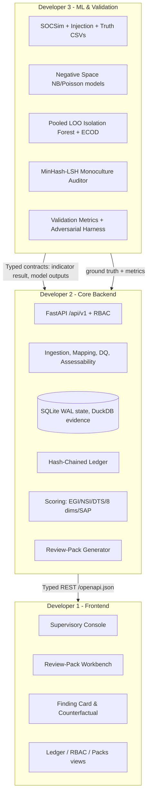

# Orion (SAT-SA) — Team Build Responsibilities (v2)

**Project**: Supervisory Analytics Tool for SOC Assessment (SAT-SA) for NCIIPC
**Team structure**: 3 developers — 1 Frontend + 2 Backend (Core Backend, ML & Validation) *(confirmed)*
**Stack**: Next.js 16 (App Router) + React 19 + Tailwind v4 + Shadcn UI | Python 3.11 + FastAPI + DuckDB / Polars + SQLite (WAL) + scikit-learn + Pydantic v2
**Aligned with**: `docs/implementation_plan_v2.md` (authoritative build plan) and `docs/backend-architecture.md`

> The v2 plan is larger than v1. This document rebalances the three workstreams around the **P0 / P1 / P2** priorities in the plan (§12) and freezes the interfaces between them so all three streams can work in parallel without merge conflicts.

---

## 1. Executive Summary & Collaboration Contract

Orion is decoupled across three strict ownership boundaries. Shared behaviour is defined once as a **frozen interface** (§2) and consumed, never re-implemented.

**Collaboration rules**

1. **OpenAPI is the contract.** Frontend builds against `openapi.json` generated by Core Backend; no undocumented fields.
2. **Indicator result object is frozen** (§2.1). ML and Core both emit it; nobody changes it unilaterally.
3. **Validation is independent.** `eval/injection.py` is authored by a person who does **not** author the indicator logic. Splits are **by entity, never by time**.
4. **No silent drops.** Anything unparseable goes to quarantine and is visible to the examiner.
5. **Every output is explainable.** No finding ships without a finding card and evidence row IDs.

---

## 2. Frozen Interfaces (change requires all three to agree)

### 2.1 Indicator result object (`app/schemas/indicator.py`)

`indicator_id`, `entity_id`, `period`, `value`, `peer_baseline {median, mad, percentile, n_peers}`, `self_baseline`, `effect_size`, `n`, `confidence`, `evidence_query`, `evidence_row_ids[]`, `benign_explanations[]`, `required_fields[]`.

### 2.2 Finding card (Core Backend owns; Frontend renders; ML supplies attributions)

Summary, baseline, effect size, confidence breakdown, corroborating signals, benign explanations, evidence row IDs + stored query, lineage, suggested actions, "why flagged", "why not flagged", counterfactual.

### 2.3 Model output (ML owns; Core persists)

`model_id`, `entity_id`/`case_id`, `features`, `score`, `attributions[]`, `direction`, `seed`, `confidence`, `evidence_row_ids[]`. Any ML flag must be restatable as "these features deviate in this direction versus this peer group", otherwise it is a **low-confidence lead** only.

### 2.4 Review pack (`app/schemas/review_pack.py`)

Pack id, item list, per-item risk score, **inclusion probability π**, "selected because" text, verification prompts, stratum, and Horvitz-Thompson prevalence estimate with CI.

### 2.5 Ledger event (`app/services/ledger.py`)

`prev_hash`, `timestamp`, `actor`, `action`, `payload_hash`, `entry_hash`. Actions enum is shared and versioned.

### 2.6 Signed pack (`app/services/pack_manager.py`)

Ed25519 signature + content hash; indicator definitions, policy profiles, baselines, optional model files.

---

## 3. Ownership Matrix (v2 modules)

| Area | Path | Owner |
|---|---|---|
| UI shell & routing | `frontend/app/**` | Dev 1 |
| Domain components | `frontend/components/supervisory/**` | Dev 1 |
| API client & types | `frontend/lib/api.ts`, `frontend/lib/types.ts` | Dev 1 |
| API routers & RBAC deps | `app/api/v1/**`, `app/api/v1/deps.py` | Dev 2 |
| Storage & models | `app/db/**` | Dev 2 |
| Ingestion & mapping & DQ | `app/services/ingestion_service.py`, `mapping_assistant.py`, `assessability.py`, `pseudonymisation.py` | Dev 2 |
| Policy profiles | `app/services/policy_profile.py`, `data/policies/**` | Dev 2 |
| Peer baselines | `app/services/baseline_service.py` | Dev 2 (models co-designed with Dev 3) |
| Scoring | `app/services/scoring_service.py` | Dev 2 |
| Review packs & verdicts | `app/services/review_pack.py` | Dev 2 |
| Ledger & packs & auth | `app/services/ledger.py`, `pack_manager.py`, `auth.py` | Dev 2 |
| Evidence & finding cards | `app/services/evidence_service.py`, `report_generator.py` | Dev 2 |
| Indicators (EG/NS) | `app/services/rules_engine.py` | Dev 2 (Dev 3 supplies statistical models) |
| Negative space models | `app/ml/negative_space.py` | Dev 3 |
| Outlier & attributions | `app/ml/anomaly_engine.py`, `ecod.py`, `attributions.py` | Dev 3 |
| NLP auditor | `app/ml/nlp_auditor.py` | Dev 3 |
| Pipeline orchestration | `app/ml/pipeline.py` | Dev 3 (interface with Dev 2) |
| SOCSim & injection & metrics | `eval/**`, `app/ml/dataset_generator.py` | Dev 3 |
| Offline bundle & sovereignty | `scripts/**`, `deploy/**` | Dev 2 (Dev 1 helps for frontend build) |

---

## 4. Developer Scopes

### Developer 1 — Frontend Lead

**Scope**: the supervisory console against the v2 API. Section references are to `docs/frontend-architecture.md`.

1. **Design system & shell** — governed by `frontend/DESIGN.md`; local fonts and icons only (air-gap rule).
2. **Executive view** — EGI / NSI / DTS, **8-dimension** peer radar, SAP tier with rank interval, and a distinct **Not assessable** state.
3. **Review-Pack Workbench** — pack list, items with inclusion probability and "selected because" text, verification prompts, verdict capture (confirmed / benign / insufficient information).
4. **Finding Card & evidence drawer** — why flagged, why not flagged (including indicators that were not computable), counterfactual, evidence rows, lineage, template-cluster highlighting.
5. **Submissions & assessability** — upload, mapping review/approval, DQ report, per-dimension Assessable / Partial / Not assessable with missing fields.
6. **Governance views** — trends, ledger + verify, packs stage/promote/rollback, policy profiles (read-only for Supervisor/Examiner; admin gated).
7. **Supervisory brief export** — PDF/print (was "Export Dossier").

**Deliverables**: `frontend/app/(dashboard)/**`, `frontend/components/supervisory/**`, `frontend/lib/api.ts`, `frontend/lib/types.ts`.

### Developer 2 — Core Backend Lead

**Scope**: backbone, schema, storage, ingestion, indicators, baselines, scoring, review packs, ledger, RBAC, API.

1. **Schema & storage** — every table in plan §3; SQLite WAL state + DuckDB/Parquet evidence; DuckDB single-writer.
2. **Ingestion** — formats CSV/TSV/JSON/NDJSON/Parquet/SQLite/SQL dump/XLSX; 10-stage pipeline with quarantine and ledger registration; vendor YAML profiles + fuzzy mapping assistant; upload security limits.
3. **Privacy** — HMAC pseudonymisation, note redaction, encrypted originals.
4. **Assessability & DQ** — DQ score and per-dimension matrix; `Not assessable` kept distinct from `low risk`.
5. **Policy & baselines** — signed versioned policy profiles; LOO median/MAD + EB shrinkage with cohorts and min-peer fallback.
6. **Indicators** — EG-01…EG-17, NS-01…NS-06 as hypothesis indicators; integrate Dev 3 models for attribution.
7. **Scoring** — EGI/NSI/DTS/8 dims/SAP, FDR, family max, capped noisy-OR, rank intervals and tiers.
8. **Review packs, ledger, RBAC, packs** — PPS sampling, hash-chained ledger + verify, `reproduce_finding`, Argon2 RBAC, pack lifecycle.
9. **API + supervisory brief** — all `/api/v1` routes and the brief export.

**Deliverables**: `backend/app/main.py`, `app/api/**`, `app/db/**`, `app/services/**`, `app/schemas/**`.

### Developer 3 — ML & Validation Lead

**Scope**: statistical models, offline NLP, and the validation harness in `eval/`.

1. **SOCSim** — YAML-configured, 20–30 entities, 8 archetypes, diurnal/weekly/holiday arrival patterns, lognormal service times, templated + varied notes, assets and telemetry heartbeats. `dataset_generator.py` becomes the SOCSim entry point.
2. **Weakness injection** — dose parameter for the full labelled set; HARD NEGATIVES (legit fast closes, legit MSSP templates, small quiet entities, maintenance silence); emit `entity_truth.csv` and `case_truth.csv`.
3. **Negative space models** — Poisson/negative-binomial zero-run probability with multiple-testing correction and criticality weighting; NB expectation with cross-month persistence; declared-hours + Indian holiday calendar.
4. **Outlier & attribution** — pooled LOO Isolation Forest with fixed seed, TreeSHAP/permutation attributions, ECOD.
5. **NLP auditor** — MinHash-LSH blocked by entity and analyst, TF-IDF within clusters, monoculture index and High/Critical cluster share.
6. **Validation** — metric suite, dose-response, hard-negative FPR, calibration, missing-field robustness, adaptive-gaming degradation, 1M/10M/50M scale; `real_data_protocol.md`.
7. **Model inventory** — maintain the architecture / training-data / purpose table and the six AI/ML items.

**Independence rule**: Dev 3 owns both the models *and* the validation harness, so `eval/injection.py` must be written and reviewed by a team member who does not write the indicator logic (Dev 3 writes injection for Dev 2's indicators; Dev 2 does not edit injection scenarios).

**Deliverables**: `backend/app/ml/**`, `backend/eval/**`, `backend/scripts/bench/**`.

---

## 5. Priority Workstreams

**P0 — must ship (all three)**

| Dev | P0 items |
|---|---|
| Dev 1 | Shell, Executive EGI/NSI/DTS + 8-dim radar, Review-Pack Workbench, Finding Card + evidence, Submissions/DQ, brief export |
| Dev 2 | Schema, ingestion + mapping + privacy, assessability, policy + baselines, P0 indicators, scoring, review packs, ledger, RBAC, P0 API routes |
| Dev 3 | SOCSim, injection + truth CSVs, P0 statistical models (NS-01/02/04/05, attribution), core metrics, bench scripts |

**P1 — differentiators**: P1 indicators (EG-12…EG-17, NS-03, NS-06); ECOD; signed pack stage/promote/rollback; trends + change points; adversarial harness; SBOM + sovereignty check; governance UI.

**P2 — design-only**: optional note embeddings (off by default); covariate-adjusted peer model as primary; extra export formats.

**Compression rules (if time is short):** demote in this order — pack rollback → change-point detection → extra export formats → ECOD. **Never cut:** finding cards with evidence, negative-space indicators, offline proof (sovereignty check), validation numbers.

---

## 6. Timeline & Milestones (duration assumed)

> Team size is **confirmed**: 1 frontend + 2 backend (Core Backend, ML & Validation). The **duration** below is assumed because it was not specified; confirm the wall-clock window (OQ-3).

| Phase | Focus | Dev 1 | Dev 2 | Dev 3 |
|---|---|---|---|---|
| **P1 Foundation** | Contracts & skeleton | Shell, types from OpenAPI, empty views | Schema, ingestion skeleton, ledger, RBAC deps | SOCSim archetypes, injection schema, truth CSVs |
| **P2 Core build** | Data in, signals out | Executive + submissions views | Full ingestion, assessability, baselines, P0 indicators, scoring | Negative-space models, IF + attributions, NLP auditor |
| **P3 Integration** | Wire end to end | Review packs, finding cards, trends, governance views | Review packs, findings/evidence endpoints, brief export | Metrics suite, dose-response, hard negatives |
| **P4 Validation & polish** | Numbers & proof | Polish, accessibility, print brief | Sovereignty check, offline bundle, SBOM, benchmarks | Real-data protocol, adversarial harness, calibration |

**Freeze points**: schema freeze at end of P1; indicator result object freeze at start of P3; pack format freeze before P4.

---

## 7. Merge & Integration Rules

1. **Migrations first.** Schema changes land in `app/db/models.py` + migration before any service consumes them.
2. **Backend leads the API.** Frontend never invents fields; missing fields are a Core Backend ticket.
3. **ML exposes pure functions** with typed inputs/outputs; no direct SQLite writes by `app/ml`.
4. **Ledger is append-only.** No service may update or delete `ledger_entry`.
5. **Packs are signed.** A local dev pack may be unsigned only in `tests/`.
6. **One owner per file.** Cross-owner edits go through a short PR note referencing this document.

---

## 8. Definition of Done (per workstream)

| Workstream | Done means |
|---|---|
| Frontend | Builds offline (no CDN/fonts), renders all v2 score outputs incl. Not assessable, exports brief |
| Core Backend | P0 endpoints green, ledger verifies, `reproduce_finding` matches, quarantine visible, no silent drops |
| ML & Validation | SOCSim + injection reproducible with fixed seeds, metrics reported with hardware, hard-negative FPR reported |
