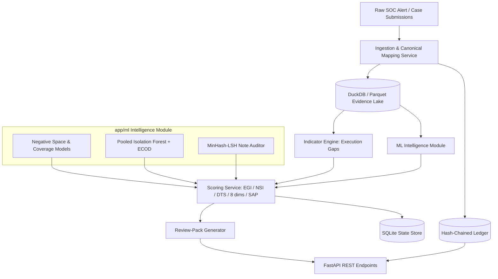

# Orion (SAT-SA) — Backend Implementation Plan v2

**System**: Supervisory Analytics Tool for SOC Assessment (SAT-SA) for NCIIPC
**Application**: Orion Core Backend & ML Intelligence Engine
**Tech stack**: Python 3.11 • FastAPI • DuckDB / Polars • SQLite (WAL) • scikit-learn • Pydantic v2
**Status**: Revised implementation plan (supersedes `docs/backend-architecture.md`)
**Constraint**: Fully offline / air-gapped. Batch, periodic submissions only. Human examiners decide.

---

## Document Control

| Item | Value |
|---|---|
| Document | `docs/implementation_plan_v2.md` |
| Supersedes | `docs/backend-architecture.md` (v1, left untouched) |
| Reference design | `docs/Full Solution Plan.md` — **not present in repo** (see §13, OQ-1) |
| Companion | `docs/implementation_plan_v2_CHANGELOG.md` (gap analysis, change log, checklist) |
| Scope | Backend only. UI lives in `docs/frontend-architecture.md` and `docs/frontend/DESIGN.md`. |
| Non-scope | No source-code changes in this pass. |
| Source of truth | Evidence = Parquet/DuckDB; State = SQLite (WAL). See §3.2. |
| Terminology | Outputs are **hypotheses with evidence**, never verdicts or compliance grades. |

**How to read this document.** `[NEW]` marks a module or table that does not exist in v1. `[CHANGED]` marks a v1 module, table, or definition that is modified. Untagged items are carried over from v1. Section numbers 3, 4 and 5 are preserved from v1 so existing references still resolve; §6 (old "Execution & Performance Benchmarks") is replaced by §9.

**Repo reality check.** As inspected, `backend/` is empty and only `frontend/` plus `docs/` exist. Every backend path below is therefore a plan; `[NEW]`/`[CHANGED]` describe the delta against the v1 *document*, not against code. Conflicts are listed in §13.

---

## 1. Architectural Philosophy & Air-Gapped Constraints

1. **Strictly offline and air-gapped.** No cloud, SaaS, CDN, or externally hosted AI at runtime. No calls to cloud APIs or LLM endpoints. All detectors, rule packs and optional models run on local CPU/RAM. Proven by the sovereignty check (§11.4).
2. **Batch supervisory analysis, not operations.** Orion analyses periodic submissions. It is not a SIEM, not real-time, performs no continuous collection, and uses no agents on CSE networks.
3. **Human examiners decide.** Orion emits **prioritised hypotheses with evidence and confidence**, never verdicts, scores of record, or compliance grades. "Not assessable" is a first-class outcome, distinct from "low risk".
4. **No invented measurements.** Every performance figure in this document is labelled **target (to be benchmarked)** unless produced by a script under `backend/scripts/bench/` with the hardware stated (§9.6).
5. **Deterministic, reproducible explanation even where detectors are statistical.** A statistical detector may raise a candidate, but the *explanation* attached to every finding is a deterministic, re-runnable query over stored evidence. `reproduce-finding` re-executes the stored `evidence_query` and must return identical `evidence_row_ids`. `[CHANGED from v1 §1.4]`
6. **Dual-tier storage.** SQLite (WAL) holds application state, ledger, findings, packs and users. DuckDB/Polars holds columnar evidence. DuckDB is **single-writer**; ingestion and runs execute as background jobs, never in the request thread.
7. **Additive modularity.** Modules are added, not renamed, so v1 references keep resolving. Deprecated modules stay as thin compatibility shims.

---

## 2. Directory Layout & Module Structure

```text
backend/
├── app/
│   ├── main.py                          [CHANGED]  lifecycle: background worker, RBAC middleware
│   ├── config.py                        [CHANGED]  pack/policy paths, HMAC key ref, Ed25519 pubkeys, upload limits
│   ├── api/
│   │   └── v1/
│   │       ├── router.py                [CHANGED]  aggregates new routers
│   │       ├── deps.py                  [NEW]      auth/RBAC deps, pagination, idempotency keys
│   │       └── endpoints/
│   │           ├── entities.py          [CHANGED]
│   │           ├── triage.py            [CHANGED]  delegates to review_pack service, kept for compatibility
│   │           ├── findings.py          [CHANGED]  real list/detail/evidence endpoints (v1 listed none)
│   │           ├── ingestion.py         [CHANGED]  submissions + data-quality report
│   │           ├── benchmarks.py        [CHANGED]  peer baselines
│   │           ├── reports.py           [CHANGED]  "supervisory brief" (was "official dossier")
│   │           ├── submissions.py       [NEW]
│   │           ├── runs.py              [NEW]
│   │           ├── review_packs.py      [NEW]
│   │           ├── verdicts.py          [NEW]
│   │           ├── trends.py            [NEW]
│   │           ├── ledger.py            [NEW]
│   │           ├── packs.py             [NEW]
│   │           ├── policy.py            [NEW]
│   │           └── assessability.py     [NEW]
│   ├── db/
│   │   ├── sqlite.py                    [CHANGED]  WAL, migrations, ledger tables
│   │   ├── duckdb_client.py             [CHANGED]  single-writer connection manager
│   │   └── models.py                    [CHANGED]  all new tables (§3)
│   ├── schemas/
│   │   ├── entity.py                    [CHANGED]
│   │   ├── triage.py                    [CHANGED]
│   │   ├── ingestion.py                 [CHANGED]
│   │   ├── finding.py                   [CHANGED]
│   │   ├── indicator.py                 [NEW]      standard indicator result object
│   │   ├── submission.py                [NEW]
│   │   ├── run.py                       [NEW]
│   │   ├── review_pack.py               [NEW]
│   │   ├── verdict.py                   [NEW]
│   │   ├── ledger.py                    [NEW]
│   │   ├── pack.py                      [NEW]
│   │   └── assessability.py             [NEW]
│   ├── services/
│   │   ├── ingestion_service.py         [CHANGED]  full pipeline (§4)
│   │   ├── rules_engine.py              [CHANGED]  hypothesis indicators (§3.4 of v1)
│   │   ├── risk_scorer.py               [CHANGED]  compatibility shim -> scoring_service
│   │   ├── report_generator.py          [CHANGED]  supervisory brief
│   │   ├── pseudonymisation.py          [NEW]      HMAC pseudonyms + note redaction
│   │   ├── mapping_assistant.py         [NEW]      fuzzy mapping suggestions
│   │   ├── assessability.py             [NEW]      per-dimension assessability matrix
│   │   ├── policy_profile.py            [NEW]      versioned/signed policy profiles
│   │   ├── baseline_service.py          [NEW]      LOO peer baselines + EB shrinkage
│   │   ├── scoring_service.py           [NEW]      EGI/NSI/DTS/8 dims/SAP (§6)
│   │   ├── review_pack.py               [NEW]      PPS sampling + controls (§7)
│   │   ├── trend_service.py             [NEW]      per-period scores + change points
│   │   ├── evidence_service.py          [NEW]      stored evidence queries + row IDs
│   │   ├── ledger.py                    [NEW]      hash-chained append-only ledger
│   │   ├── pack_manager.py              [NEW]      signed pack stage/promote/rollback
│   │   └── auth.py                      [NEW]      RBAC + Argon2 + sessions
│   └── ml/
│       ├── __init__.py
│       ├── dataset_generator.py         [CHANGED]  thin re-export of eval.socsim (keeps v1 import path)
│       ├── negative_space.py            [CHANGED]  Poisson/NB expected-rate models (§4.6)
│       ├── anomaly_engine.py            [CHANGED]  pooled LOO Isolation Forest + attributions
│       ├── nlp_auditor.py               [CHANGED]  MinHash-LSH monoculture auditor (§4.8.2)
│       ├── ecod.py                      [NEW]      ECOD entity-level outlier detector
│       ├── attributions.py              [NEW]      TreeSHAP / permutation deltas
│       └── pipeline.py                  [CHANGED]  orchestration + run registration
├── eval/                                 [NEW]      validation harness (§9)
│   ├── socsim.py                        [NEW]      SOCSim generator
│   ├── archetypes.yaml                  [NEW]
│   ├── injection.py                     [NEW]      labelled weakness + hard-negative injection
│   ├── metrics.py                       [NEW]
│   ├── runner.py                        [NEW]
│   ├── adversarial.py                   [NEW]      adaptive-gaming harness
│   └── real_data_protocol.md            [NEW]
├── data/
│   ├── seed/                            [CHANGED]  20-30 synthetic entities (was 3)
│   ├── sqlite/                          [CHANGED]  orion.db + ledger
│   ├── parquet/                         [CHANGED]  evidence lake
│   ├── policies/                        [NEW]      policy_<profile>.yaml
│   ├── mappings/                        [NEW]      vendor mapping profiles
│   ├── packs/                           [NEW]      staged/ and active/
│   ├── reference/                       [NEW]      india_holidays.csv, mitre_expectations.yaml
│   └── keys/                            [NEW]      Ed25519 public keys only
├── scripts/                             [NEW]
│   ├── sovereignty_check.py             [NEW]
│   ├── build_offline_bundle.py          [NEW]
│   ├── ledger_verify.py                 [NEW]
│   ├── reproduce_finding.py             [NEW]
│   └── bench/                           [NEW]      benchmark scripts (produce or refuse numbers)
├── deploy/                              [NEW]      offline bundle, SBOM, systemd unit
├── tests/
│   ├── test_rules.py                    [CHANGED]
│   ├── test_ml_pipeline.py              [CHANGED]
│   ├── test_ingestion.py                [CHANGED]
│   ├── test_ledger.py                   [NEW]
│   ├── test_scoring.py                  [NEW]
│   └── test_review_pack.py              [NEW]
├── requirements.txt
└── run.py
```

**Ownership.** Keeps the v1 split (`docs/build-responsibility.md`): Core backend owns `api/`, `db/`, `services/`; ML owns `ml/` and `eval/`. `eval/injection.py` should be written by a person who does not author indicator logic (§9.3).

---

## 3. Canonical Data Schema (Normalized Supervisory Model)

### 3.1 Normalization rules

| Concern | Rule |
|---|---|
| Time | All timestamps stored UTC ISO-8601; original offset retained only in `submission.schema_profile`. |
| Severity | Canonical 4 level: `CRITICAL`, `HIGH`, `MEDIUM`, `LOW`. Vendor `INFO`/`INFORMATIONAL` maps to `LOW`; unmapped values quarantine. |
| State | Canonical case state machine: `NEW → OPEN → IN_PROGRESS → (ESCALATED) → RESOLVED → CLOSED`, plus `REOPENED`. Vendor statuses map via `status_map`. |
| Identity | Analyst IDs, source IPs and hostnames are HMAC-pseudonymised at ingestion (§3.14). |
| Missing | Missing fields are recorded, never imputed for scoring. Silence is evidence (negative space). |

### 3.2 Storage tiers and source of truth

| Store | Role | Contents | Truth |
|---|---|---|---|
| SQLite (WAL) | Application **state** | entity, asset registry, submission ledger, record_version, run, finding, review_pack, verdict, ledger_entry, user, policy/pack registry | **State of record** |
| DuckDB + Parquet | Evidence **lake** | alert_record, case_record, case_event, escalation, telemetry_daily, note_store (redacted) | **Evidence of record** |

DuckDB is opened single-writer by the background worker. API requests only read committed Parquet/DuckDB snapshots and SQLite.

### 3.3 Table reference

| Table | Status | Store | Purpose |
|---|---|---|---|
| `entity` | [CHANGED] | SQLite | CSE registry + SOC profile |
| `asset` | [NEW] | SQLite | Asset inventory, criticality, environment, expected log sources |
| `alert_record` | [CHANGED] | DuckDB/Parquet | Normalised alert |
| `case_record` | [CHANGED] | DuckDB/Parquet | Normalised case |
| `case_event` | [NEW] | DuckDB/Parquet | Case state-transition history |
| `escalation` | [NEW] | DuckDB/Parquet | Escalation records |
| `telemetry_daily` | [NEW] | DuckDB/Parquet | Daily heartbeat/volume per asset+source |
| `submission` | [NEW] | SQLite | Periodic submission metadata + DQ |
| `record_version` | [NEW] | SQLite | Per-record hash across submissions (retroactive-edit detection) |
| `alert_case` | [NEW] | DuckDB/Parquet | Bridge replacing `associated_alert_ids` list |
| `note_store` | [NEW] | SQLite (metadata) + encrypted blob ref | Redacted notes, shingle signature, encrypted original |
| `run` | [NEW] | SQLite | Analysis run + lineage |
| `finding` | [NEW] | SQLite | Indicator result object |
| `finding_evidence` | [NEW] | SQLite | Finding ↔ evidence row bridge |
| `dimension_score` | [NEW] | SQLite | Per-period dimension scores + interval |
| `review_pack` / `review_pack_item` | [NEW] | SQLite | Sampling pack + inclusion probabilities |
| `verdict` | [NEW] | SQLite | Examiner verdict for calibration |
| `ledger_entry` | [NEW] | SQLite (append-only) | Hash-chained audit ledger |
| `mapping_profile` | [NEW] | SQLite | Approved vendor mapping profiles |
| `policy_profile` | [NEW] | SQLite | Active/previous signed policy profiles |
| `pack` | [NEW] | SQLite | Signed pack registry |
| `user`, `role_assignment`, `session` | [NEW] | SQLite | RBAC |

### 3.4 `entity` (Critical Sector Entity) [CHANGED]

| Field | Type | Notes |
|---|---|---|
| `entity_id` | string PK | e.g. `CSE-ALPHA-POWER` |
| `name` | string | Display name |
| `sector` | string FK `sector_ref` | Extensible: `sector_ref` is a lookup table, not a fixed enum. |
| `soc_model` | enum | `in-house` / `MSSP` / `hybrid` **[NEW]** |
| `soc_hours` | structured | `coverage_type` (`24x7` / `extended` / `business`), `declared_open`, `declared_close`, `roster_ref` **[NEW]** |
| `size_tier` | enum | `small` / `medium` / `large` (policy-defined bands) **[NEW]** |
| `tooling_profile` | JSON | Declared SIEM/SOAR/ticketing tools **[NEW]** |
| `critical_asset_count` | int | Carried from v1 |
| `created_at` | datetime | Carried from v1 |

### 3.5 `asset` [NEW]

| Field | Type | Notes |
|---|---|---|
| `asset_id_pseudo` | string PK | HMAC of hostname/FQDN |
| `entity_id` | FK | |
| `asset_class` | string | e.g. `SCADA`, `payment-switch`, `HLR`, `domain-controller` |
| `criticality` | int 1-4 | 4 = crown jewel |
| `environment` | enum | `IT` / `OT` / `DMZ` / `cloud` / `unknown` |
| `expected_log_sources` | JSON list | Feeds NS-01 expected-rate model |
| `onboarded` | date | Start of expected telemetry |
| `decommissioned` | date null | Suppresses false negatives after retirement |

### 3.6 `alert_record` [CHANGED]

| Field | Type | Notes |
|---|---|---|
| `alert_id` | string | Unique within entity |
| `entity_id` | FK | |
| `timestamp` | datetime | v1 field, retained for compatibility |
| `event_ts` | datetime null | Preferred; optional because some exports omit it **[NEW]** |
| `title` | string | |
| `severity_raw` | string | As submitted **[NEW]** |
| `severity_norm` | enum 4-level | Normalised **[NEW]** |
| `rule_id` | string | Detection rule identity **[NEW]** |
| `source_tool` | string | Splunk/Elastic/QRadar/Sentinel/Wazuh/... **[NEW]** |
| `mitre_tactic` / `mitre_technique_id` | string | |
| `source_ip_pseudo` | string | HMAC of source IP **[CHANGED: was raw source_ip]** |
| `destination_asset_id` | FK `asset_id_pseudo` | |
| `asset_criticality` | int 1-4 | Derived from `asset` |
| `status` | string | Raw status; normalised into `case_event` |
| `auto_closed_flag` | bool | Automation closed it **[NEW]** |
| `closed_by_pseudo` | string | HMAC **[NEW]** |
| `case_id` | string null | Link; also in bridge table **[NEW]** |

### 3.7 `case_record` [CHANGED]

| Field | Type | Notes |
|---|---|---|
| `case_id` | string PK | |
| `entity_id` | FK | |
| `created_at`, `closed_at` | datetime | |
| `investigation_duration_sec` | int | Derived, null if missing (never imputed) |
| `analyst_pseudo` | string | HMAC of analyst_id **[CHANGED]** |
| `closed_by_pseudo` | string | HMAC **[NEW]** |
| `actor_type` | enum | `human` / `automation` / `unknown` **[NEW]** |
| `severity_norm` | enum 4-level | **[NEW]** |
| `escalation_level` | enum | as v1 |
| `disposition` | enum | `TRUE_POSITIVE` / `FALSE_POSITIVE` / `BENIGN_ANOMALY` / `SUPPRESSED` |
| `root_cause_action` | string | Feeds EG-05 |
| `note_ref` | FK `note_store` | Replaces inline `investigation_notes` **[CHANGED]** |

`associated_alert_ids` is **removed**; links live in `alert_case` (§3.10).

### 3.8 `case_event` [NEW]

| Field | Type | Notes |
|---|---|---|
| `event_id` | string PK | |
| `case_id` | FK | |
| `ts` | datetime | |
| `event_type` | enum | `created` / `assigned` / `note_added` / `status_changed` / `severity_changed` / `escalated` / `closed` / `reopened` |
| `actor_pseudo` | string | HMAC |
| `actor_type` | enum | `human` / `automation` / `unknown` |
| `from_state` / `to_state` | string | |
| `note_ref` | FK null | |

Required by EG-04 (severity-change history), EG-12 (throughput), EG-13 (conformance), EG-15/16 (shift/timestamp forensics).

### 3.9 `escalation` [NEW]

`escalation_id` PK • `case_id` FK • `ts` • `target` • `reason_code` • `acknowledged_ts` null • `outcome`.
Required by EG-06 (absence of escalation), EG-07 (rate plausibility).

### 3.10 `telemetry_daily` [NEW]

`entity_id` • `asset_id_pseudo` • `source_type` • `date` • `event_count` • `last_seen_ts`. Required by NS-01, NS-03, NS-05.

### 3.11 `submission` [NEW]

| Field | Type | Notes |
|---|---|---|
| `submission_id` | string PK | |
| `entity_id` | FK | |
| `period_start`, `period_end` | date | Drives EG-09 backlog washing |
| `received_ts` | datetime | |
| `manifest_hash` | string | Verified at ingest |
| `schema_profile` | string | Detected/mapped profile id |
| `row_counts` | JSON | Per table |
| `declared_kpis` | JSON null | Feeds EG-14 **[part of NEW]** |
| `dq_score` | float 0-1 | §4.4 |
| `version` | int | Monotonic per entity |

### 3.12 `record_version` [NEW]

`record_key` • `submission_id` • `record_hash` • `key_field_snapshot` (JSON).
Enables EG-11 (retroactive edits) and EG-17 (deletions/gaps) via cross-submission hash diffs.

### 3.13 `alert_case` bridge [NEW]

`alert_id` • `case_id` • `link_type` (`explicit` / `inferred`). Replaces the v1 list column.

### 3.14 `note_store` [NEW]

`note_ref` PK • `entity_id` • `analyst_pseudo` • `redacted_text` • `shingle_signature` • `length` (int) • `encrypted_original_ref`.
Note originals are stored only as an encrypted blob reference; `redacted_text` is what detectors and APIs read.

### 3.15 Data tiers

| Tier | Definition | Illustrative contents |
|---|---|---|
| **A — minimum** | Alert + case core | alert metadata, case records, closure timestamps, dispositions, notes (redacted), actor identity |
| **B — recommended** | Workflow + governance | `case_event` state history, `escalation`, `asset` inventory, `submission` + `record_version`, declared SOC hours/roster, declared KPIs |
| **C — enrichment** | Coverage + expectations | `telemetry_daily` heartbeats, `expected_log_sources`, MITRE expectation reference, common-shock reference feeds, holiday calendar |

| Indicator | Minimum tier | Notes |
|---|---|---|
| EG-01, EG-02, EG-05, EG-06, EG-07, EG-08, EG-09, EG-10, EG-16 | A | Alerts + cases + notes + timestamps |
| NS-02, NS-04, NS-06 | A | Category field, record links, peer cohort |
| EG-03, EG-04, EG-11, EG-12, EG-13, EG-14, EG-15, EG-17 | B | Need state history, roster, submissions, declared KPIs |
| NS-03 | B | Needs declared SOC hours |
| NS-01, NS-05 | C (B = alert-only proxy) | Tier C adds telemetry heartbeats and expected-rate model |

### 3.16 Privacy & pseudonymisation [NEW]

1. `analyst_id`, `source_ip`, `hostname`/FQDN are HMAC-SHA-256 pseudonymised at ingestion with a deployment key held outside the repo (`config.py` references a key handle, never the key).
2. Notes are redacted for IPs, emails and hostnames before storage; originals are encrypted at rest and referenced only.
3. Full-text and note views are role-gated (Auditor read-only, Examiner scoped) and every view is a ledger entry.
4. Pseudonyms are stable within an entity so baselines work, but cannot be reversed without the key.

---

## 4. Rules, Indicators & Analytical Engines

### 4.1 Framing: hypotheses, not breaches

v1 called rule outputs "unambiguous regulatory breaches". This is **[CHANGED]** to **hypothesis indicators**: a signal is a reason to look, expressed with a baseline, effect size, confidence and counter-evidence. No indicator may assert non-compliance.

Every indicator returns the same object (`schemas/indicator.py`, persisted to `finding`):

| Field | Meaning |
|---|---|
| `indicator_id` | e.g. `EG-01` |
| `entity_id` | CSE |
| `period` | `{start, end}` |
| `value` | Observed statistic (with units) |
| `peer_baseline` | `{median, mad, percentile, n_peers}` |
| `self_baseline` | `{median, mad, periods}` (entity's own history) |
| `effect_size` | Robust z after shrinkage, or rate ratio |
| `n` | Supporting observation count |
| `confidence` | `min(1, n/n_min) × assessability × data_trust` |
| `evidence_query` | Stored, re-runnable query id |
| `evidence_row_ids` | Explicit row keys shown to the examiner |
| `benign_explanations` | Candidate innocent explanations to check |
| `required_fields` | Fields consumed; missing ones drive assessability |

### 4.2 Policy profiles and baselines replace hardcoded thresholds

Thresholds are **policy-configurable, versioned and signed** (`data/policies/policy_<profile>.yaml`, loaded by `policy_profile.py`). Peer-relative baselines with **empirical-Bayes (EB) shrinkage** are the primary decision path; hardcoded values remain only as documented defaults.

| v1 hardcode | v2 default | Primary v2 mechanism |
|---|---|---|
| 180 s fast closure | `fast_closure_seconds: 180` (default) | Robust z of closure-duration vs peer/self baseline |
| < 20 note words | `note_min_words: 20` (default) | Note substance + monoculture cluster share |
| > 25 cases / 30 min | `max_closures_30min: 25` (default) | Throughput model vs `soc_hours` + human plausibility |
| 0.88 similarity | `cluster_similarity: 0.88` (default) | MinHash-LSH cluster membership then TF-IDF score |
| > 5 repeats / 14 days | `repeat_count: 5`, `repeat_window_days: 14` (default) | Recurrence vs base rate + root-cause absence |

Policy profile schema (abridged): `profile_id`, `version`, `effective_from`, `severity_map`, `status_map`, `state_machine`, `timezone`, `thresholds{}`, `ramps{z0,z1}`, `dimension_weights{}`, `sla_targets{}`, `n_min`, `min_peers`, `fdr_q`, `tier_cutpoints{T1..T4}`.

### 4.3 Indicator families → 8 capability dimensions

| Family | Indicators | Dimensions (primary → secondary) |
|---|---|---|
| Rapid / thin closure | EG-01, EG-02, EG-10 | Investigation → IR, OD |
| Escalation integrity | EG-06, EG-07 | Escalation → IR, Governance |
| Governance & records | EG-04, EG-11, EG-14, EG-17 | Governance → OD |
| Metric gaming | EG-08, EG-09, EG-15 | Operational Discipline → Governance |
| Throughput / process | EG-12, EG-13 | Security Operations → Governance |
| Timestamp integrity | EG-16 | Operational Discipline → Governance |
| Recurrence | EG-05 | Incident Response → Cyber Resilience |
| Coverage (negative space) | NS-01, NS-02, NS-03, NS-05, NS-06 | Threat Detection → Cyber Resilience, SO |
| Record integrity (negative space) | NS-04 | Investigation → IR |

All eight dimensions are represented: Threat Detection (TD), Investigation (INV), Escalation (ESC), Incident Response (IR), Security Operations (SO), Governance and Oversight (GOV), Operational Discipline (OD), Cyber Resilience (CR).

### 4.4 Data-quality score and assessability matrix

`dq_score` = weighted mean of completeness, validity, timeliness, consistency, uniqueness, mapping confidence. Per dimension, assessability is one of **Assessable (1.0) / Partial (0.5) / Not assessable (0.0)**, always listing the missing fields that caused it.

| Dimension | Required evidence | Min tier | Not assessable when | Partial when |
|---|---|---|---|---|
| Threat Detection | alert category/MITRE, event_ts; telemetry for NS-01/05 | B | no category field and no telemetry | telemetry only, no asset inventory |
| Investigation | case, case_event, notes, dispositions | A | no dispositions or notes | closed_at or notes missing |
| Escalation | escalation, case severity | A | no escalation field at all | escalation field present but unsigned |
| Incident Response | closure, root_cause, recurrence | A | no closure timestamps | root_cause absent |
| Security Operations | case_event, throughput, soc_hours | B | no workflow events or hours | hours declared but no roster |
| Governance and Oversight | submission, record_version, declared KPIs | B | single submission only | no declared KPIs → EG-14 not assessable |
| Operational Discipline | workflow timestamps | A | no sub-case timestamps | only case-level timestamps |
| Cyber Resilience | assets, telemetry, recurrence, common-shock | B/C | no asset inventory | alerts only, no telemetry |

**Rule**: `Not assessable` is reported as its own state and never collapsed into "low risk" (§6.3).

### 4.5 Indicator catalogue

#### 4.5.1 Execution Gap (EG) indicators

| ID | Name | Pri | Dimensions | Required tables / fields | Min tier | Output |
|---|---|---|---|---|---|---|
| EG-01 | Rapid closure of high/critical | P0 | INV, IR, OD | case `closed_at`,`created_at`,`severity_norm`,`actor_type`; case_event `closed`/`to_state`; escalation presence | A | closure duration vs baseline |
| EG-02 | Disposition implausibility | P0 | INV, ESC | case `disposition`,`severity_norm`; note_store `length`; escalation | A | critical/high closed FALSE_POSITIVE/SUPPRESSED with thin notes |
| EG-03 | Off-coverage / off-hours closure | P0 | SO, OD | case `closed_at`; entity `soc_hours`; roster if present | B (hours) | density of closures outside declared hours |
| EG-04 | Undocumented severity change | P0 | GOV, ESC | case_event `severity_changed` `from_state`/`to_state`; alert `severity_raw`/`severity_norm`; actor_type | B | downgrades with no note/escalation |
| EG-05 | Recurrence without root cause | P0 | IR, CR | alert `rule_id`,`destination_asset_id`,`event_ts`; alert_case; case `root_cause_action` | A | repeat signature, no remediation evidence |
| EG-06 | Critical closed without escalation | P0 | ESC, IR | case `severity_norm`,`disposition`; escalation absence; case_event | A | critical closures with no escalation record |
| EG-07 | Escalation-rate implausibility | P0 | ESC, GOV | escalation; case counts; entity `soc_model`,`size_tier` | A | escalation rate vs cohort |
| EG-08 | SLA threshold bunching | P0 | OD, GOV | case `investigation_duration_sec`; policy `sla_targets` | A | spike just under SLA |
| EG-09 | Backlog washing | P0 | OD, GOV | case `closed_at`; submission `period_end`; case_event `ts` | A | closures massed at period boundary |
| EG-10 | Template note monoculture | P0 | INV | note_store `shingle_signature`,`redacted_text`; case `analyst_pseudo`,`severity_norm` | A | monoculture index + cluster share |
| EG-11 | Retroactive edits across submissions | P0 | GOV, OD | submission `version`,`received_ts`; record_version `record_hash`; case_event | B | records changed after receipt |
| EG-12 | Impossible human throughput | P1 | SO | case_event `ts`,`actor_pseudo`,`actor_type`; entity `soc_hours` | B | closures/hour beyond human plausibility |
| EG-13 | Process conformance deviation | P1 | SO, GOV | case_event state sequence; declared/peer workflow | B | deviation from declared or peer-consensus path |
| EG-14 | Reported vs recomputed KPI | P1 | GOV | submission `declared_kpis`; recomputed case metrics | B | declared≠recomputed |
| EG-15 | Shift-boundary patterns | P1 | OD | case_event `ts`; roster if present | B | bunching at handover |
| EG-16 | Timestamp forensics | P1 | OD, GOV | case_event `ts`; case `created_at`/`closed_at`; alert `event_ts` | A | impossible ordering, fabrication artefacts |
| EG-17 | Sequence-ID gaps / deletions | P1 | GOV, OD | alert/case monotonic ids; record_version | B | missing ids, deletions |

#### 4.5.2 Negative Space (NS) indicators

| ID | Name | Pri | Dimensions | Required tables / fields | Min tier | Output |
|---|---|---|---|---|---|---|
| NS-01 | Silent critical assets | P0 | TD, CR | asset (`criticality`,`asset_class`,`environment`,`expected_log_sources`,`onboarded`,`decommissioned`); telemetry_daily (`event_count`,`last_seen_ts`,`date`); alerts by asset | C (B = alert-only proxy) | zero-run probability + "silent since" |
| NS-02 | Absent alert categories | P0 | TD | alert `mitre_tactic`,`mitre_technique_id`,`source_tool`,`event_ts`; asset_class; mitigation expectations | A (+C reference) | missing categories vs NB expectation |
| NS-03 | Temporal inactivity / coverage lapse | P1 | SO, TD | telemetry/alert `ts` by hour/day; entity `soc_hours`; India holiday calendar | B | inactivity vs declared hours/holidays |
| NS-04 | Orphan records | P0 | INV, IR | alert `case_id`; alert_case; case `case_id`; case_event; escalation | A | alerts/cases/escalations with no counterpart |
| NS-05 | Implausibly low activity | P0 | SO, TD | telemetry_daily `event_count`; alert counts; entity `size_tier` | A/C | volume below cohort expectation |
| NS-06 | Common-shock non-response | P1 | TD, CR | alert `event_ts`,`rule_id`; peer cohort spikes | A | peers spike, entity silent |

**Definition fixes carried from v1.**
- **EG-03** `[CHANGED]`: v1 name ("Off-Hours") did not match its definition ("during shift handover"). v2 defines it against **declared SOC hours / roster** and reports the hour bands affected; shift-handover bunching moves to EG-15.
- **EG-04** `[CHANGED]`: v1 inferred downgrade from current state alone. v2 requires **`case_event` severity-change history**; without Tier B it returns `Not assessable`.

### 4.6 Negative Space methodology fixes

1. **NS-01 Asset Telemetry Vacuum.** Join `asset` against `telemetry_daily`; model expected event rate by `asset_class` and `environment`; compute the probability of a zero-run of length *L* under Poisson / negative-binomial; correct for multiple testing (Benjamini-Hochberg) and weight by `criticality`. Report a **"silent since"** date, not just a boolean. Skip `decommissioned` assets and pre-`onboarded` dates.
2. **NS-02 MITRE divergence.** Use a **negative-binomial expectation** (overdispersion-aware) and require **persistence across months** before elevating, instead of a single month of sector median comparison.
3. **NS-03/EG-03 temporal.** Use **declared SOC hours** and the bundled static **Indian holiday calendar** (`data/reference/india_holidays.csv`) so legitimate quiet periods are hard negatives, not findings.

### 4.7 Automation vs humans

1. `actor_type` distinguishes `human` / `automation` / `unknown`; when absent it is **inferred** and the finding is labelled **"inferred actor type"**.
2. Automation-generated template work is **not itself** a weakness; the question is whether **a human reviewed high-severity closures** (EG-01/EG-02/EG-06).
3. MSSP-run SOCs form a **separate cohort** for baselines (§6.4), because shared templates across clients are normal for an MSSP but suspicious for an in-house SOC.

### 4.8 ML & NLP engines

#### 4.8.1 Outlier detection (`anomaly_engine.py`, `ecod.py`, `attributions.py`)

1. **Isolation Forest** is fit on a **pooled reference population with leave-one-out** (exclude the scored entity), never on the entity's own data. Fixed seed recorded in `run.seed`.
2. **Per-feature attributions** via TreeSHAP or permutation deltas are attached to every flagged case.
3. **ECOD** is an alternative for **entity-level** outliers because it decomposes per dimension (useful when dimensions contradict).
4. **Language rule** `[CHANGED]`: an ML flag is restated as *"these features deviate in this direction versus this peer group"* with evidence rows. If attribution or evidence is unavailable, it is shown only as a **low-confidence lead**, never as a finding.

#### 4.8.2 NLP auditor (`nlp_auditor.py`) [CHANGED]

1. Replace naive pairwise TF-IDF cosine (quadratic; will not scale) with **MinHash-LSH on word shingles**, **blocked by entity and analyst**.
2. **TF-IDF cosine is kept only for scoring within candidate clusters** after LSH blocking.
3. Report a **monoculture index** = `1 − (normalised entropy of cluster distribution)` and the **cluster share among High/Critical closures**.
4. **Embeddings are optional P2** and off by default (§12).

### 4.9 Model inventory and the six required AI/ML items

| Model | Architecture | Learned? | Training data | Purpose |
|---|---|---|---|---|
| Isolation Forest | ensemble of random trees | yes | pooled LOO reference population (submissions) | case/entity outlier lead |
| ECOD | empirical cumulative distribution | no (empirical) | reference population | per-dimension entity outlier |
| MinHash-LSH | locality-sensitive hashing | no | notes corpus | template cluster discovery |
| TF-IDF + cosine | bag-of-words vector space | no (fitted counts) | notes within cluster | within-cluster similarity score |
| Negative-binomial / Poisson | generalised linear | estimated | entity + peer telemetry counts | expected-rate / zero-run models |
| EB shrinkage | empirical Bayes | estimated | cohort statistics | baseline stabilisation |

**Problem-statement AI/ML requirements (all six):**

| Requirement | v2 answer |
|---|---|
| Model architecture | Table above; all classical/statistical, no generative AI in the decision path. |
| Hardware requirements | CPU-only; sizing targets in §11.5. |
| Offline training & inference | Training runs locally on stored submissions; inference in-process; no network. |
| Model update mechanism | Ed25519-signed packs, staged → shadow-run → promote → rollback (§4.10). |
| Explainability controls | Per-feature attributions + deterministic evidence queries + "why not flagged" (§8.1). |
| Auditability controls | Hash-chained ledger + `run` lineage + `reproduce-finding` (§8.2). |

### 4.10 Signed pack lifecycle (`pack_manager.py`) [NEW]

1. Packs contain indicator definitions, policy profiles, baselines, and optional model files.
2. Each pack is **Ed25519-signed**; the install verifies signature **and** content hash against `data/keys/*.pub`.
3. A pack is **staged**, then **shadow-run** against the active pack; a **diff report** shows changed findings.
4. Only after review is it **promoted**; the previous pack stays for **rollback**.
5. Every stage/promote/rollback is a **ledger entry**.

---

## 5. API Endpoints Specification

All endpoints are under `/api/v1`, require RBAC (§8.3), and are read-only unless noted. **Every endpoint maps to a service.**

| Method | Endpoint | Description | Service | Status |
|---|---|---|---|---|
| GET | `/entities` | CSE list with EGI/NSI/DTS and SAP tier | `baseline_service` + `scoring_service` | [CHANGED] |
| GET | `/entities/{id}/summary` | Scorecard, dimension radar, assessability | `scoring_service` + `assessability` | [CHANGED] |
| GET | `/entities/{id}/assessability` | Per-dimension Assessable/Partial/Not assessable + missing fields | `assessability` | [NEW] |
| POST | `/ingest/upload` | Upload batch for a submission | `ingestion_service` | [CHANGED] |
| POST | `/ingest/seed/{seed_id}` | Load a SOCSim seed dataset | `ingestion_service` | [CHANGED] |
| GET | `/submissions` | List submissions with DQ score | `ingestion_service` | [NEW] |
| GET | `/submissions/{id}` | Submission detail + data-quality report | `ingestion_service` | [NEW] |
| GET | `/submissions/{id}/mapping` | Detected mapping + suggestions | `mapping_assistant` | [NEW] |
| POST | `/submissions/{id}/mapping/approve` | Human approval of mapping (ledgered) | `mapping_assistant` | [NEW] |
| POST | `/runs` | Trigger an analysis run (background job) | `ml.pipeline` + `ledger` | [NEW] |
| GET | `/runs` / `/runs/{id}` | Run list / lineage detail | `ledger` | [NEW] |
| GET | `/findings` | Paginated findings, filter by entity/dimension/tier | `rules_engine` | [NEW] |
| GET | `/findings/{id}` | Finding card | `evidence_service` | [NEW] |
| GET | `/findings/{id}/evidence` | Evidence rows + stored query | `evidence_service` | [NEW] |
| GET | `/findings/{id}/counterfactual` | "Why not flagged" / counterfactual view | `evidence_service` | [NEW] |
| GET | `/review-packs` | List review packs | `review_pack` | [NEW] |
| POST | `/review-packs` | Generate review pack (PPS + controls) | `review_pack` | [NEW] |
| GET | `/review-packs/{id}` | Pack items, inclusion probabilities, prompts | `review_pack` | [NEW] |
| GET | `/review-packs/{id}/export` | PDF/XLSX/JSON export (hashed, signed) | `report_generator` + `ledger` | [NEW] |
| POST | `/verdicts` | Record examiner verdict (confirmed/benign/insufficient) | `review_pack` + `ledger` | [NEW] |
| GET | `/trends` | Per-period dimension trends | `trend_service` | [NEW] |
| GET | `/trends/change-points` | Regime-shift candidates | `trend_service` | [NEW] |
| GET | `/ledger` | Paged ledger entries | `ledger` | [NEW] |
| GET | `/ledger/verify` | Verify hash chain, return head hash | `ledger` | [NEW] |
| POST | `/packs/stage` | Stage signed pack | `pack_manager` | [NEW] |
| POST | `/packs/{id}/shadow` | Shadow-run vs active pack + diff | `pack_manager` | [NEW] |
| POST | `/packs/{id}/promote` | Promote pack | `pack_manager` | [NEW] |
| POST | `/packs/{id}/rollback` | Roll back to previous pack | `pack_manager` | [NEW] |
| GET | `/policy-profiles` | List policy profiles | `policy_profile` | [NEW] |
| POST | `/policy-profiles/{id}/activate` | Activate profile (ledgered) | `policy_profile` | [NEW] |
| GET | `/triage` | Compatibility alias to latest review pack | `review_pack` | [CHANGED] |
| GET | `/triage/{id}/evidence` | Compatibility alias to finding evidence | `evidence_service` | [CHANGED] |
| GET | `/benchmarks` | Sector/cohort baselines | `baseline_service` | [CHANGED] |
| POST | `/reports/{entity_id}/export` | Compile the **supervisory brief** (was "official NCIIPC dossier") | `report_generator` | [CHANGED] |

**Fix:** v1 listed a `findings` router with no endpoints. `/findings`, `/findings/{id}`, `/findings/{id}/evidence` and the counterfactual view are now specified and backed by `evidence_service`.

---

## 6. Supervisory Scoring

### 6.1 Score outputs (replaces the single 0-100 index) [CHANGED]

| Output | Meaning |
|---|---|
| **Execution Gap Index (EGI)** | Aggregate of evidence-of-bad-practice indicators |
| **Negative Space Index (NSI)** | Aggregate of absence-of-expected-evidence indicators |
| **Data Trust Score (DTS)** | Confidence that the submission can support assessment |
| **Eight dimension indicators** | TD, INV, ESC, IR, SO, GOV, OD, CR |
| **Supervisory Attention Priority (SAP)** | Ranking signal + interval + tier |

The old composite "Entity Risk Index (0–100)" is **removed** as a decision artefact. A 0–100 convenience value may be rendered by the UI but is not stored as the score of record.

### 6.2 Signal mapping

1. Compute robust z: `z = (x − median_peer) / (1.4826 × MAD_peer)`.
2. Apply **EB shrinkage** toward the cohort mean, weighted by `n`.
3. Map |z_shrunk| to 0–1 with a **configurable ramp** `z0..z1`.
4. `confidence = min(1, n/n_min) × assessability × data_trust`.
5. Apply **Benjamini-Hochberg FDR** per entity per cycle at `fdr_q`.
6. Aggregate **indicator families by family maximum**.
7. Aggregate families to a dimension with a **capped noisy-OR** so correlated indicators do not double count: `dim = 1 − Π(1 − w_f × min(family_f, cap))`.

### 6.3 Rank intervals and tiers

- Output **rank intervals**, not point ranks: **weight perturbation** (Dirichlet draws over dimension weights) and **bootstrap** over peers → `[low, high]`.
- Attention tiers **T1–T4** plus a separate **`Not assessable`** state.
- Tier cut points are **policy-configurable**; a `Not assessable` dimension cannot raise an entity's tier.

### 6.4 Peer baselines

- **Leave-one-out** (entity excluded from its own peer set), **median/MAD**.
- **Cohorts**: sector × `size_tier` × `soc_model` × `soc_hours`.
- **Minimum-peer rule**: direct cohort baseline requires `n_peers ≥ min_peers` (default 8); otherwise fall back to a **covariate-adjusted model** (e.g. negative-binomial GLM on log rate with sector/size/SOC covariates).

### 6.5 Trend analysis

- Persist **per-period dimension scores** in `dimension_score` (score, CI, assessability, DTS, tier, `run_id`, `pack_version`).
- **Change-point detection** for regime shifts (offline, fixed seed).
- Expose via `/trends` and `/trends/change-points`.

---

## 7. Sampling & Triage — Review-Pack Generator (`review_pack.py`) [CHANGED]

Replaces the plain ranked list with a **review-pack generator**:

1. **Case risk score** per case from its findings and confidence.
2. **Targeted slice** by **probability-proportional-to-risk (PPS) sampling** with **known inclusion probabilities** `π_i`.
3. **Diversity caps** per template cluster and per analyst (no single cluster/analyst dominating).
4. **Random control slice**, stratified by severity.
5. **Horvitz-Thompson prevalence estimates** with confidence intervals.
6. Per-case **"selected because" text** and **verification prompts**.
7. **Export** as PDF, XLSX and JSON **with hashes** (§8.2).
8. **Examiner verdicts** (`confirmed`, `benign`, `insufficient information`) stored in `verdict` for calibration.

Endpoint coverage: `/review-packs` and `/review-packs/{id}` (§5).

---

## 8. Explainability & Audit

### 8.1 Finding card specification

Every finding card contains: **summary**, **baseline**, **effect size**, **confidence breakdown** (`n`, assessability, DTS), **corroborating signals**, **benign explanations to check**, **evidence row IDs + stored query**, **lineage** (submission manifest hashes, pack version, policy hash, code version), and **suggested examiner actions**. It also includes:

- **"Why flagged"** — indicator, value, baseline, effect size.
- **"Why not flagged"** — which indicators ran, their values, and which were **not computable** and why (missing fields / tier).
- **Counterfactual view** — what value/field change would clear or raise the finding.

### 8.2 Hash-chained append-only ledger (`ledger.py`) [CHANGED from "audit logs in SQLite"]

`ledger_entry`: `prev_hash`, `timestamp`, `actor`, `action`, `payload_hash`, `entry_hash` (`entry_hash = H(prev_hash ‖ timestamp ‖ actor ‖ action ‖ payload_hash)`).

Logged actions: submissions, mapping approvals, runs (input manifest hashes, config hash, pack, seed, code version, output hash), policy and pack changes, exports, note views, verdicts, logins, role changes.

Tooling: `scripts/ledger_verify.py` verifies the chain and prints the head hash; `scripts/reproduce_finding.py` re-runs a finding's stored query. **Exports are Ed25519-signed and include the ledger head hash.**

### 8.3 RBAC (`auth.py`) [NEW]

| Role | Rights |
|---|---|
| Supervisor | Full supervisory read, run approval, brief export |
| Examiner | Scoped read, verdict entry, review packs |
| Auditor | Read-only, **including ledger and verify** |
| Administrator | User/role/pack administration |
| Data Custodian | Submission intake, mapping approval, no findings verdicts |

Argon2 password hashing, session timeouts, least privilege, and a ledger entry for every login and role change.

---

## 9. Validation Methodology & Performance

### 9.1 SOCSim (`eval/socsim.py`, `app/ml/dataset_generator.py`) [CHANGED]

v1's `dataset_generator.py` becomes the **SOCSim** entry point (kept as a thin re-export so v1 imports resolve).

- **YAML-configured** (`eval/archetypes.yaml`), **20–30 synthetic entities** across sectors (not 3).
- **Archetypes**: mature, average, understaffed, MSSP-run, metric-gaming, blind-spot, data-fabricating, and small-and-legitimately-quiet.
- **Realistic arrival patterns**: diurnal, weekly, holidays (Indian calendar), injection-driven spikes.
- **Severity and category mixes**, **lognormal service times**, **templated and varied notes**, **asset inventory** and **telemetry heartbeats**.

### 9.2 Labelled weakness injection (`eval/injection.py`)

Inject labelled weaknesses with a **dose** parameter: fast closure, critical without escalation, template monoculture, SLA bunching, backlog washing, silent critical assets, missing categories, low volume, orphans, ID gaps and deletions, retroactive edits, common-shock non-response, timestamp fabrication, adaptive gaming.

Also generate **HARD NEGATIVES**: legitimate fast closes via auto-enrichment, legitimate MSSP templates, small quiet entities, maintenance-window silence.

Emit `entity_truth.csv` and `case_truth.csv`.

### 9.3 Avoiding circular validation

- Injection scenarios are written **independently of indicator code** (ideally by a different team member).
- Test/validation splits are **by entity, never by time**.

### 9.4 Metrics (`eval/metrics.py`)

| Level | Metrics |
|---|---|
| Entity | Spearman, top-k recall |
| Case | precision@k, recall@k, NDCG, lift vs random and severity-stratified sampling |
| Effort | examiner effort to reach 80% recall |
| Power | detection vs dose (dose-response curves) |
| Safety | false-positive rate on hard negatives |
| Calibration | calibration curve |
| Robustness | missing fields at 10–50% |
| Gaming | adaptive-gaming degradation with and without triangulation |
| Scale | 1M / 10M / 50M alerts, hardware stated |

### 9.5 Real-data protocol (later phases, `eval/real_data_protocol.md`)

Blind back-test against past manual review outcomes; expert adjudication of additional findings; **inter-examiner agreement (Cohen's kappa or Krippendorff's alpha) as the ceiling**; shadow pilot with proposed acceptance criteria **clearly marked as proposals**.

### 9.6 Performance & Scale (replaces v1 "Execution & Performance Benchmarks") [CHANGED]

**No performance number is asserted as fact.** Every figure is a **target (to be benchmarked)**. A number becomes a measured result only when `backend/scripts/bench/` produces it, with the hardware recorded below.

| Scenario | Target (to be benchmarked) | Benchmark script |
|---|---|---|
| DuckDB aggregate, 500k alerts | sub-100 ms | `scripts/bench/bench_duckdb.py` |
| Full pipeline, 50k cases | a few seconds on 4-core CPU | `scripts/bench/bench_pipeline.py` |
| Ingestion throughput, 1M alerts | to be measured | `scripts/bench/bench_ingest.py` |
| Scale: 1M / 10M / 50M alerts | to be measured | `eval/runner.py --scale` |

Hardware profiles are stated in §11.5. v1 numbers (`< 80 ms`, `< 4 s`) are **relabelled targets** because no benchmark script existed in the repo.

---

## 10. Goodhart Resistance & Integrity [NEW]

Indicators can be gamed once known. Controls:

1. **Triangulated indicators** — no single signal decides; correlated families are capped (§6.2).
2. **Metric-displacement detection** — if one metric improves while a related one degrades, flag displacement.
3. **Rotating indicator subsets** with a **fixed unannounced core** so the visible surface changes but the core cannot be targeted.
4. **Cross-submission diffs via `record_version` hashes** (EG-11, EG-17).
5. **Timestamp forensics** (EG-16).
6. **Robust statistics** (median/MAD, EB shrinkage) so outliers cannot drag baselines.
7. **Adversarial harness inside SOCSim** (`eval/adversarial.py`) that re-optimises against the current pack and reports degradation.

---

## 11. Deployment & Operations

### 11.1 Offline bundle

- **Hashed wheelhouse**: all Python deps vendored and installed with `pip install --require-hashes -r requirements.txt`.
- **Frontend build** with **no CDNs and no external fonts** (bundled).
- **CycloneDX SBOM** generated at build time.
- **Detached signature** over the bundle (Ed25519).
- `scripts/build_offline_bundle.py` produces the bundle; install and **self-test** steps documented in `deploy/`.

### 11.2 Source of truth

Parquet/DuckDB = **evidence**; SQLite = **state** (§3.2). Backups: SQLite via WAL-safe snapshot; evidence via Parquet file copy; ledger backed up with the SQLite file and verified with `/ledger/verify` after restore.

### 11.3 Backup and restore

Documented, scripted, and tested. Post-restore `ledger_verify` must match the pre-backup head hash.

### 11.4 Sovereignty check (`scripts/sovereignty_check.py`)

Proves no outbound network: runs the app with egress denied (host firewall / network namespace) and asserts **zero** outbound connections during startup, ingest, run and export.

### 11.5 Hardware profiles (sizing **targets**)

| Profile | Purpose | Target |
|---|---|---|
| Pilot | Demo / one entity set | 4-core CPU, 16 GB RAM, 100 GB SSD, no GPU |
| Production | Multi-entity national | 16-core CPU, 64–128 GB RAM, 2 TB NVMe, no GPU |

### 11.6 Mermaid (rendering fix)

In the v1 diagram, `MLEngine` was used as **both a node id and a subgraph id**. v2 uses node id `MLMod` and subgraph id `MLEngine`:



### 11.7 Relationship to the 2-page architecture document

This is a **backend implementation plan**. The SIH submission separately requires a **2-page architecture document**. Outline in Appendix A.

---

## 12. Build Priorities

| Priority | Definition | Scope |
|---|---|---|
| **P0** | Must ship | Indicators EG-01…EG-11, NS-01, NS-02, NS-04, NS-05; schema tables; ingestion formats + mapping; assessability; scoring; review packs; finding cards; ledger; offline bundle; SOCSim + injection + core metrics |
| **P1** | Differentiators | EG-12…EG-17, NS-03, NS-06; ECOD; pack stage/promote/rollback; trends + change points; adversarial harness; SBOM; sovereignty check |
| **P2** | Design-only | Optional note embeddings; covariate-adjusted peer model beyond fallback; extra export formats |

**Compression rules if time is short** — the following may be reduced (P1 → P2, or demonstrated rather than built): pack rollback, change-point detection, extra XLSX/PDF variants, ECOD. **Never cut:** finding cards with evidence, negative-space indicators, offline proof (sovereignty check), validation numbers.

---

## 13. Open Questions

| ID | Question |
|---|---|
| OQ-1 | **Resolved (accepted):** `docs/Full Solution Plan.md` is absent and will not be added. `backend-architecture.md` + `project-overview.md` + `problem-statement.md` are the reference. |
| OQ-2 | **Resolved:** `backend/` stays empty; the backend is greenfield and all `[NEW]` modules are built from scratch. |
| OQ-3 | **Partially resolved:** team = 3 (1 frontend + 2 backend: Core Backend, ML & Validation). Wall-clock duration still to confirm; the build phases are assumed. |
| OQ-4 | **Resolved:** the theme is unchanged from the original specification (see `frontend-architecture.md` §4). `frontend/DESIGN.md` is untouched. The light-first/dark-first discrepancy is noted but no theme change is made. |
| OQ-5 | Do we include note embeddings (P2)? Default is off. |
| OQ-6 | Is there an existing offline-sovereignty/egress layer to reuse, or should `scripts/sovereignty_check.py` be built fresh? |
| OQ-7 | All docs now adopt EGI/NSI/DTS/8 dims/SAP (the 0–100 score of record has been removed from `AGENTS.md`, `project-overview.md` and `frontend-architecture.md`). Confirm the frontend build will follow. |
| OQ-8 | All docs now specify SOCSim with 20–30 entities. Confirm whether the Alpha/Beta/Gamma names should be retained as SOCSim presets for the demo. |
| OQ-9 | Ed25519 private-key custody: which offline signer/holder, and is a hardware token available? |
| OQ-10 | HMAC pseudonymisation key custody and rotation policy. |

---

## Appendix A — 2-Page Architecture Document Outline

1. **Problem & boundary** — supervisory analytics, not a SOC/SIEM; batch only.
2. **Architecture diagram** — ingestion → evidence lake → indicators/ML → scoring → review packs → API/UI; ledger alongside.
3. **Data model & tiers** — A/B/C; source of truth (Parquet evidence, SQLite state).
4. **Indicators & negative space** — families, baseline method, example finding.
5. **Explainability & audit** — finding card, hash-chained ledger, RBAC.
6. **Validation** — SOCSim, injection, metrics, hard negatives.
7. **Offline deployment** — bundle, hashed wheelhouse, sovereignty check, SBOM.
8. **Sizing** — pilot/production targets, stated as targets.

## Appendix B — Consistency Matrix

| Check | Result |
|---|---|
| Every indicator has tables/fields in §3 | Yes — see §4.5 tables and §3.3–3.14 |
| Every indicator has a minimum tier | Yes — §4.5 |
| Every endpoint maps to a service | Yes — §5 |
| `findings` router has real endpoints | Yes — §5 |
| Every performance number labelled target or benchmarked | Yes — §9.6, §11.5 |
| "Not assessable" distinct from "low risk" | Yes — §4.4, §6.3 |
| Mermaid node/subgraph id collision fixed | Yes — §11.6 (`MLMod` vs `MLEngine`) |
| Deterministic explanation over statistical detectors | Yes — §1.5, §8.1, §8.2 |
