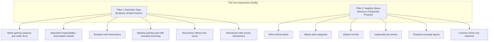

# Orion: Supervisory Analytics Tool for SOC Assessment (SAT-SA)

**Project Name**: Orion
**Problem Statement ID**: 26157 (Smart India Hackathon 2026)
**Stakeholder**: National Critical Information Infrastructure Protection Centre (NCIIPC), Government of India
**System Class**: National Supervisory Cyber Analytics Capability
**Plan of record**: `docs/implementation_plan_v2.md` | **Architecture**: `docs/backend-architecture.md`

---

## 1. Executive Summary & Core Mission

Orion is a specialised, air-gapped **Supervisory Analytics Tool for SOC Assessment (SAT-SA)** for examiners and cyber supervisors at the **National Critical Information Infrastructure Protection Centre (NCIIPC)**.

NCIIPC assesses the cyber resilience of **Critical Sector Entities (CSEs)** across national domains such as Power Grids, Financial Services, Telecommunications, Civil Aviation, and Strategic Infrastructure. Historically, periodic evaluations relied on hand-sampling alerts and case records. Expert human inspection consistently uncovers governance breakdowns that self-assessments, compliance checklists, and vendor KPI dashboards conceal, but manual review cannot scale across dozens of entities processing millions of events.

Orion removes that scalability barrier. It transforms periodic submissions of SOC alert metadata, case-management records, asset inventories, and investigation workflows into an empirical, supervisory-level view of a CSE's actual cyber resilience.

```text
+-----------------------------------------------------------------------------------+
|                            SUPERVISORY OBJECTIVE                                  |
|                                                                                   |
|  NOT: "Is this specific alert malicious?" (Operational SOC / SIEM)                |
|  BUT: "Does this entity possess genuine, disciplined capabilities to detect,      |
|        investigate, escalate, and remediate cyber threats across its operations?" |
+-----------------------------------------------------------------------------------+
```

**Outputs are prioritised hypotheses with evidence and confidence, never verdicts or compliance grades.** "Not assessable" is a first-class result, distinct from "low risk".

---

## 2. Operational Scope: What Orion Is and Is Not

### Explicitly In Scope
* Periodic, **batch** analysis of structured SOC submissions (CSV, TSV, JSON/NDJSON, Parquet, SQLite/SQL dump, XLSX).
* Identification of operational discipline breakdowns and metric gaming.
* Discovery of unmonitored blind spots and missing security telemetry.
* Cross-entity peer comparison and national sector benchmarking.
* Risk-prioritised review packs to guide human examiners.
* Fully offline, air-gapped, on-premises execution with no cloud dependencies.
* Evidence-linked traceability: every hypothesis cites underlying operational records.

### Strictly Out of Scope
* Not a SOC, SIEM, SOAR, or real-time correlation engine.
* Not a real-time sensor, packet sniffer, or endpoint agent.
* Not a centralised multi-tenant log warehouse; no continuous collection.
* Minimises reliance on raw payloads, customer personal info, or packet captures.
* No generative AI in the decision path.

---

## 3. The Core Supervisory Problem: The Dual Challenge

Examiners repeatedly find that documentation paints a rosy picture while operational records tell the opposite story. Orion models this through two analytical pillars.



### Pillar A: Execution Gaps
Documented controls, SLA metrics, or executive reports claim robust defence, but case workflows show superficial or deceptive behaviour: rapid closure of high severity, disposition implausibility, criticals closed without escalation, template notes, SLA bunching, backlog washing, recurrence without remediation, and retroactive edits.

### Pillar B: Negative Space
What is *missing*. Total silence is often a symptom of failure: critical assets with no telemetry, missing alert categories, orphan records, implausibly low activity, declared-hours coverage lapses, and non-response when peer entities see a common shock.

Indicator definitions are in `docs/implementation_plan_v2.md` §4.5 (P0 set plus P1 differentiators).

---

## 4. End-to-End System Architecture

```text
+-----------------------------------------------------------------------------------+
|  DATA INGESTION LAYER (batch only)                                                |
|  - Formats: CSV, TSV, JSON/NDJSON, Parquet, SQLite/SQL dump, XLSX                  |
|  - Vendor mapping profiles (Splunk, Elastic, QRadar, Sentinel, TheHive,           |
|    ServiceNow, Wazuh) + fuzzy mapping assistant for human confirmation            |
|  - Pipeline: receive -> verify manifest -> detect -> map -> normalise ->          |
|    validate -> quarantine -> pseudonymise/redact -> load -> ledger                 |
+-----------------------------------------+-----------------------------------------+
                                          |
                                          v
+-----------------------------------------------------------------------------------+
|  LOCAL STORAGE ENGINE (zero cloud)                                               |
|  - Evidence of record: DuckDB / Parquet (alerts, cases, events, telemetry, notes) |
|  - State of record: SQLite (WAL) (submissions, findings, packs, ledger, users)    |
+--------------------+------------------------------------+-------------------------+
                     |                                    |
                     v                                    v
+------------------------------------+   +------------------------------------------+
|  INDICATOR ENGINE                  |   |  ML & ANALYTICS INTELLIGENCE ENGINE      |
|  - Execution gaps EG-01..EG-17     |   |  - Negative space Poisson/NB models      |
|  - Negative space NS-01..NS-06     |   |  - Pooled LOO Isolation Forest + ECOD    |
|  - Policy profiles + baselines     |   |  - MinHash-LSH monoculture auditor       |
+--------------------+---------------+   +--------------------+---------------------+
                     |                                        |
                     +-------------------+--------------------+
                                         |
                                         v
+-----------------------------------------------------------------------------------+
|  PEER BASELINE + SCORING                                                         |
|  - Leave-one-out median/MAD, EB shrinkage, cohorts, covariate fallback            |
|  - Execution Gap Index, Negative Space Index, Data Trust Score, 8 dimensions,     |
|    Supervisory Attention Priority (SAP) with rank intervals                       |
+----------------------------------------+-----------------------------------------+
                                         |
                                         v
+-----------------------------------------------------------------------------------+
|  REVIEW-PACK GENERATOR + API + CONSOLE                                           |
|  - PPS sampling with known inclusion probabilities, controls, HT estimates        |
|  - Finding cards, evidence service, trends, ledger, packs, RBAC                   |
|  - Next.js 16 supervisory console (offline assets only, no CDNs)                  |
+-----------------------------------------------------------------------------------+
```

---

## 5. Machine Learning & Analytical Methodology

All algorithms run locally on commodity CPU hardware. No external APIs, no cloud LLMs, no generative AI in the decision path. Every model is listed in the model inventory (`implementation_plan_v2.md` §4.9) with architecture, whether it is learned, training data and purpose, plus the six required AI/ML items (architecture, hardware, offline training/inference, update mechanism, explainability controls, auditability controls).

### 5.1 Outlier Detection (Pooled Isolation Forest + ECOD)
* **Goal**: surface anomalous investigation patterns as leads, never verdicts.
* **Method**: Isolation Forest is fit on a **pooled reference population with leave-one-out** (the scored entity is excluded), with a fixed seed. ECOD is used for entity-level outliers because it decomposes per dimension.
* **Attribution**: TreeSHAP or permutation deltas per feature.
* **Language rule**: a flagged case is restated as *"these features deviate in this direction versus this peer group"* with evidence rows; otherwise it is shown only as a low-confidence lead.

### 5.2 Negative Space Statistical Models
* **Silent critical assets**: Poisson/negative-binomial zero-run probability by asset class and environment, corrected for multiple testing, weighted by criticality, reporting a **"silent since"** date.
* **Absent alert categories**: negative-binomial expectation with **cross-month persistence**, not a single sector median.
* **Temporal inactivity**: evaluated against **declared SOC hours** and the bundled Indian holiday calendar so legitimate quiet periods are not flagged.

### 5.3 Offline NLP Note Auditor
* **Method**: **MinHash-LSH on word shingles blocked by entity and analyst** (linear-ish; scales), with TF-IDF cosine used only for scoring within candidate clusters.
* **Outputs**: a **monoculture index** (1 − normalised entropy of the cluster distribution) and the **cluster share among High/Critical closures**.
* **Automation aware**: template work by automation is not itself a weakness; the question is whether a human reviewed high-severity closures. MSSP-run SOCs form a separate cohort.

---

## 6. Synthetic Benchmark Datasets (SOCSim)

For zero-setup evaluation, Orion includes **SOCSim** (`backend/eval/socsim.py`): YAML-configured synthetic data for **20–30 entities** across sectors, replacing the v1 three-entity demo.

* **Archetypes**: mature, average, understaffed, MSSP-run, metric-gaming, blind-spot, data-fabricating, and small-and-legitimately-quiet.
* **Realism**: diurnal/weekly/holiday arrival patterns, severity and category mixes, lognormal service times, templated and varied notes, asset inventories, and telemetry heartbeats.
* **Labelled weaknesses** injected with a dose parameter, plus **hard negatives** (legitimately fast auto-enrichment closes, legitimate MSSP templates, small quiet entities, maintenance-window silence).
* **Ground truth**: `entity_truth.csv` and `case_truth.csv`; splits are **by entity, never by time**.

Validation metrics include entity/case ranking, examiner effort to reach 80% recall, dose-response curves, hard-negative false-positive rate, calibration, missing-field robustness, adaptive-gaming degradation, and 1M/10M/50M scale tests. All performance figures are **targets (to be benchmarked)** unless a `backend/scripts/bench/` script produces them with hardware stated.

---

## 7. Explainability, Traceability, and Auditability

1. **Finding cards**: summary, baseline, effect size, confidence breakdown, corroborating signals, benign explanations to check, evidence row IDs and stored query, lineage (submission hashes, pack version, policy hash, code version), and suggested examiner actions.
2. **"Why flagged" / "Why not flagged"**: which indicators ran, their values, and which were **not computable** and why.
3. **Counterfactual view**: what would clear or raise the finding.
4. **Hash-chained ledger**: append-only entries (`prev_hash`, timestamp, actor, action, payload hash, entry hash) for submissions, mapping approvals, runs, policy/pack changes, exports, note views, verdicts, logins, role changes. `ledger_verify` and `reproduce_finding` are bundled.
5. **Signed exports**: briefs carry an Ed25519 signature and the ledger head hash.
6. **RBAC**: Supervisor, Examiner, Auditor (read-only incl. ledger), Administrator, Data Custodian; Argon2 hashing; least privilege.

---

## 8. Privacy & Data Tiers

* **Pseudonymisation**: analyst IDs, source IPs and hostnames are HMAC-pseudonymised at ingestion.
* **Notes**: redacted for IPs/emails/hostnames; originals encrypted at rest and referenced only; note views are role-gated and ledgered.
* **Tiers**: A = minimum (alerts, cases, dispositions, notes); B = recommended (state history, escalations, assets, submissions, declared hours/KPIs); C = enrichment (telemetry heartbeats, expectation references, holiday calendar). A/B/C determine which indicators are assessable.

---

## 9. Gaming Resistance

Indicators published in a supervisory tool become targets. Orion resists gaming through triangulated indicators, metric-displacement detection, rotating indicator subsets with a fixed unannounced core, cross-submission diffs via record hashes, timestamp forensics, robust statistics, and an adversarial harness inside SOCSim (`backend/eval/adversarial.py`).

---

## 10. Technology Stack Summary

| Layer | Technologies | Rationale |
|---|---|---|
| Frontend | Next.js 16 (App Router), React 19, Tailwind CSS v4, Shadcn UI | High-density supervisory console with zero external CDN dependencies |
| Backend API | Python 3.11, FastAPI, Pydantic v2 | Async REST API with strict typed validation and generated OpenAPI |
| State store | SQLite (WAL) | Embedded, transactional store for submissions, findings, packs and ledger |
| Evidence lake | DuckDB & Polars | Vectorised in-process analytics over large alert/case submissions |
| ML & NLP | scikit-learn, NumPy, MinHash-LSH | 100% offline, CPU-only, explainable classical methods |

---

## 11. Offline Deployment

* **Offline bundle** with a **hashed wheelhouse** (`pip install --require-hashes`), CDN-free frontend build, **CycloneDX SBOM**, and a detached Ed25519 signature.
* **Sovereignty check** (`backend/scripts/sovereignty_check.py`) proves no outbound network during startup, ingest, run and export.
* **Hardware profiles** (pilot / production) are stated as **sizing targets**.
* **Source of truth**: Parquet/DuckDB for evidence, SQLite for state. Backups include ledger verification.

---

## 12. Expected Evaluation Deliverables Mapping

| Evaluation requirement | How Orion fulfils it |
|---|---|
| 1. Solution architecture | `docs/backend-architecture.md`, `docs/frontend-architecture.md`, `docs/implementation_plan_v2.md` |
| 2. Detection of Execution Gaps | `app/services/rules_engine.py` (EG-01…EG-17) |
| 3. Detection of Negative Space | `app/ml/negative_space.py` (NS-01…NS-06) |
| 4. Explainability & Auditability | Finding cards, hash-chained ledger, RBAC, signed exports |
| 5. Air-Gapped Compliance | Offline bundle, hashed wheelhouse, sovereignty check, SBOM |
| 6. Multi-Entity Benchmarking | Peer baselines (LOO median/MAD, EB shrinkage) across cohorts |
| 7. Validation | SOCSim + injection + truth CSVs + metric suite (`backend/eval/`) |
| 8. Data requirements | Data tiers A/B/C and per-indicator assessability |
| 9. Infrastructure requirements | Hardware profiles (sizing targets) |

**Documentation set**: `docs/project-overview.md`, `docs/backend-architecture.md`, `docs/frontend-architecture.md`, `docs/build-responsibility.md`, `docs/implementation_plan_v2.md`, `docs/implementation_plan_v2_CHANGELOG.md`, `docs/AGENTS.md`, and the immutable `docs/problem-statement.md`.
