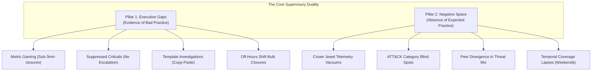

# Orion: Supervisory Analytics Tool for SOC Assessment (SAT-SA)

**Project Name**: Orion  
**Problem Statement ID**: 26157 (Smart India Hackathon 2026)  
**Stakeholder**: National Critical Information Infrastructure Protection Centre (NCIIPC), Government of India  
**System Class**: National Supervisory Cyber Analytics Capability  

---

## 1. Executive Summary & Core Mission

Orion is a specialized, air-gapped **Supervisory Analytics Tool for SOC Assessment (SAT-SA)** engineered for examiners and cyber supervisors at the **National Critical Information Infrastructure Protection Centre (NCIIPC)**.

NCIIPC evaluates the cyber resilience of **Critical Sector Entities (CSEs)** across national domains such as Power Grids, Financial Services, Telecommunications, Civil Aviation, and Strategic Infrastructure. Historically, periodic supervisory evaluations relied on sampling alerts and case records by hand. While expert human inspection consistently uncovers critical governance breakdowns that self-assessments, compliance checklists, and vendor KPI dashboards conceal, manual review cannot scale across dozens of national entities processing millions of security events.

Orion solves this scalability barrier. It transforms raw, periodic submissions of SOC alert metadata, case management records, asset inventories, and analyst investigation workflows into an empirical, supervisory-level evaluation of a CSE's actual cyber resilience.

```text
+-----------------------------------------------------------------------------------+
|                            SUPERVISORY OBJECTIVE                                  |
|                                                                                   |
|  NOT: "Is this specific alert malicious?" (Operational SOC / SIEM)                |
|  BUT: "Does this entity possess genuine, disciplined capabilities to detect,      |
|        investigate, escalate, and remediate cyber threats across its operations?" |
+-----------------------------------------------------------------------------------+
```

---

## 2. Operational Scope: What Orion Is and Is Not

To safeguard both national security and system independence, NCIIPC explicitly establishes clear boundaries between supervisory analytics and operational security tooling.

### Explicitly In Scope
* Periodic, batch analysis of structured SOC data exports (CSV, JSON, SQL/Parquet dumps).
* Identification of operational discipline breakdowns and metric gaming.
* Discovery of unmonitored blind spots and missing security telemetry.
* Cross-entity peer comparison and national sector benchmarking.
* Risk-prioritized sampling to guide human examiners to high-probability weaknesses.
* Fully offline, air-gapped, on-premises execution without cloud dependencies.
* Evidence-linked traceability where every flag cites underlying operational records.

### Strictly Out of Scope
* Not a Security Operations Centre (SOC) replacement.
* Not a SIEM, SOAR, or real-time event correlation engine.
* Not a real-time network sensor, packet sniffer, or endpoint telemetry agent.
* Not a centralized multi-tenant log ingestion warehouse.
* Minimizes reliance on raw payload data, customer personal info, or packet captures.

---

## 3. The Core Supervisory Problem: The Dual Challenge

Supervisory examiners regularly discover that compliance documentation paints a rosy picture of security, while underlying operational records tell the opposite story. Orion models this discrepancy through two analytical pillars:



### Pillar A: Execution Gaps (Operational Evidence Defies Documented Claims)
Execution Gaps occur when documented controls, SLA metrics, or executive reports claim robust defense, but granular case workflows show superficial or deceptive behavior:

1. **Metric Gaming & Rapid Closures**: Critical and High severity alerts closed in under 180 seconds simply to fulfill average-time-to-close SLAs.
2. **Unescalated Critical Incidents**: P1/P0 severity alerts resolved as "False Positive" by junior Tier-1 analysts without required escalation to Tier-2, Tier-3, or CISO oversight.
3. **Template-Driven Investigations**: Analyst notes consisting of identical copy-pasted boilerplate phrases across hundreds of disparate tickets, indicating zero substantive investigation.
4. **Shift-Handover Bulk Dumping**: Sudden spikes where 30 to 50 complex cases are closed simultaneously within 15 minutes at the end of a shift.
5. **Recurring Unremediated Incidents**: The exact same malicious behavior triggering repeatedly on the same host over 14 days without evidence of root-cause remediation.

### Pillar B: Negative Space (The Suspicious Absence of Expected Evidence)
Negative Space addresses what is missing. In complex critical infrastructure, total silence is often a symptom of failure rather than health:

1. **Crown Jewel Telemetry Vacuums**: High-value assets (such as SCADA controllers, core banking payment switches, or telecom HLR databases) generating zero security events across a 90-day assessment window.
2. **MITRE ATT&CK Matrix Blind Spots**: Entities reporting thousands of perimeter firewall or phishing alerts, but completely lacking detections in Lateral Movement (TA0008), Privilege Escalation (TA0004), or Exfiltration (TA0010).
3. **Sector Peer Deviations**: A CSE displaying an alert distribution that radically diverges from peer entities operating in the exact same critical sector under identical threat landscapes.
4. **Off-Hours Activity Gaps**: Drastic, unnatural drops in telemetry during night shifts or weekends, revealing intermittent logging or unattended monitoring stations.

---

## 4. End-to-End System Architecture

Orion unites deterministic regulatory audit logic with local, unsupervised machine learning and offline natural language processing:

```text
+-----------------------------------------------------------------------------------+
|                              DATA INGESTION LAYER                                 |
|  - Canonical Normalization Engine (CSV / JSON / Parquet / DB Dumps)               |
|  - Standard Schemas: Entities, Assets, Alerts, Cases, Analyst Workflows           |
+-----------------------------------------+-----------------------------------------+
                                          |
                                          v
+-----------------------------------------------------------------------------------+
|                        LOCAL STORAGE ENGINE (Zero Cloud)                          |
|  - SQLite (WAL Mode): ACID Application State, Triage Queues, Findings, Audit Logs|
|  - DuckDB / Polars: Vectorized Columnar Analytics across 500,000+ Alert Records   |
+--------------------+------------------------------------+-------------------------+
                     |                                    |
                     v                                    v
+------------------------------------+   +------------------------------------------+
|  DETERMINISTIC RULE ENGINE         |   |  ML & ANALYTICS INTELLIGENCE ENGINE      |
|  - Rapid Case Closure Rules        |   |  - Negative Space & Blind Spot Detector  |
|  - Unescalated Critical Rules      |   |  - Isolation Forest Outlier Profiler     |
|  - Shift Handover Mass Closures    |   |  - Offline TF-IDF Canned Note Auditor    |
|  - Repeat Offender Loop Detector   |   |  - Cross-Entity Sector Benchmark Matrix  |
+--------------------+---------------+   +--------------------+---------------------+
                     |                                        |
                     +-------------------+--------------------+
                                         |
                                         v
+-----------------------------------------------------------------------------------+
|                       SUPERVISORY RISK SCORING AGGREGATOR                         |
|  Composite Entity Risk Index (0-100) = Execution Gap Index + Negative Space Index |
+----------------------------------------+------------------------------------------+
                                         |
                                         v
+-----------------------------------------------------------------------------------+
|                       NEXT.JS 16 SUPERVISORY CONSOLE (UI)                         |
|  1. Executive Resilience Leaderboard & Sector Peer Benchmark Radar                |
|  2. Smart Sampling & Triage Queue (Prioritized review workbench for examiners)    |
|  3. Evidence Inspection Drawer (Timelines, text diffs, explainability rationale)  |
|  4. NCIIPC Supervisory Dossier Generator (Formal audit report export)             |
+-----------------------------------------------------------------------------------+
```

---

## 5. Machine Learning & Analytical Methodology

To honor NCIIPC's mandatory air-gapped constraint, Orion uses no external APIs or cloud LLMs. All algorithms run locally on commodity CPU hardware with instant, verifiable results.

### 5.1 Unsupervised Outlier Detection (Isolation Forest & LOF)
* **Goal**: Uncover anomalous investigation patterns and metric gaming without requiring pre-labeled training data.
* **Feature Vector**:
  - `log(investigation_duration_seconds)`
  - `analyst_hourly_closure_velocity`
  - `investigation_step_count`
  - `severity_weight`
  - `note_character_length`
* **Outcome**: Assigns each case an anomaly score. Investigations that take 45 seconds on high-severity threats while normal investigations average 45 minutes are isolated as extreme outliers.

### 5.2 Negative Space Statistical Deviation Model
* **Goal**: Quantify monitoring blind spots and missing operational telemetry.
* **Methodology**:
  - Computes an **Asset Coverage Ratio**: designated Crown Jewel assets observed with telemetry versus total Crown Jewels registered in the asset inventory.
  - Computes a **MITRE ATT&CK Entropy Score**: evaluates the diversity and completeness of observed tactics against national sector baselines.
  - Applies **Interquartile Range (IQR) and Z-score deviation** against peer CSEs to highlight statistically abnormal absences.

### 5.3 Offline NLP Template & Copy-Paste Auditor
* **Goal**: Detect superficial reviews and canned investigation text.
* **Methodology**:
  - Extracts text from case closure notes and analyst narratives.
  - Generates TF-IDF n-gram vectors across all tickets submitted by each analyst and entity.
  - Calculates pairwise Cosine Similarity. Clusters of tickets with similarity exceeding 0.88 are tagged with `#CannedNote` and `#SuperficialReview`.
  - Calculates a **Substance Density Score**: measures the ratio of technical tokens (IPs, hashes, process names, command arguments) against generic administrative filler words.

---

## 6. Synthetic Multi-Entity Benchmark Datasets

For zero-setup evaluation and demonstration, Orion includes three pre-calibrated synthetic CSE datasets reflecting real-world operational profiles:

| Entity Identifier | Sector | Operational Profile & Seeded Findings |
|---|---|---|
| **CSE-Alpha** | Energy / Power Grid | **High Negative Space**: Operational SCADA/OT network segments generate zero security telemetry. Weekend monitoring collapses by 80%. Lateral movement alerts are entirely absent despite extensive perimeter scanning. |
| **CSE-Beta** | Banking & Finance | **Severe Execution Gaps & Metric Gaming**: SOC analysts maintain an artificial 2.4-minute average case closure time to satisfy external SLA audits. P1 ransomware indicators closed as False Positive without Tier-2 escalation. 94% text similarity across closure notes. |
| **CSE-Gamma** | Telecommunications | **Resilient Baseline Benchmark**: Mature escalation pathways, realistic investigation duration distributions, thorough multi-step notes, and comprehensive MITRE coverage across core infrastructure. |

---

## 7. Explainability, Traceability, and Auditability

In regulatory supervision, black-box scores are unacceptable. NCIIPC examiners must justify every finding before entity leadership and regulatory boards. Orion enforces strict explainability guarantees:

1. **Deterministic Pointers**: Every risk flag links directly to immutable source data (Case ID, Alert ID, Hostname, Timestamp, Analyst ID).
2. **Transparent Rationale Card**: The Evidence Drawer presents plain-language supervisory justifications:
   - *"Flagged: Case closed in 47 seconds. Rule EG-01: Rapid Case Closure for Critical Asset. NLP Analysis: 96% text similarity to 312 other closed cases by Analyst ID #409."*
3. **Raw Operational Timelines**: Visual step-by-step reconstruction of alert trigger, assignment, note addition, and closure timestamps.
4. **Traceable Audit Dossier**: Generates a tamper-evident NCIIPC evaluation dossier detailing methodology, mathematical formulas, and sample lists ready for official regulatory filing.

---

## 8. Technology Stack Summary

| Layer | Technologies Selected | Rationale |
|---|---|---|
| **Frontend Application** | Next.js 16 (App Router), React 19, Tailwind CSS v4, Shadcn UI | Modern, high-performance, dark-theme first, high-density supervisory console with zero external CDN dependencies. |
| **Backend API** | Python 3.11+, FastAPI, Pydantic v2 | High-speed asynchronous REST API, auto-generating OpenAPI specifications with strict type validation. |
| **Data Storage (Relational)**| SQLite (WAL Mode) via SQLAlchemy | Embedded, zero-install, zero-server operational store for entity registries, audit findings, and app configuration. |
| **Data Storage (OLAP)** | DuckDB & Polars | Vectorized in-process analytical engine capable of aggregating 500,000+ alert records in sub-100ms timings. |
| **Machine Learning & NLP**| Scikit-learn, NumPy, TF-IDF Vectorizers | 100% offline, lightweight, deterministic and unsupervised models that execute rapidly on standard CPU cores. |

---

## 9. Expected Evaluation Deliverables Mapping

| Evaluation Requirement | How Orion Fulfills It |
|---|---|
| **1. Solution Architecture** | Detailed in [backend-architecture.md](/backend-architecture.md) and [frontend-architecture.md](/frontend-architecture.md). |
| **2. Detection of Execution Gaps** | Built into `services/rules_engine.py` and Isolation Forest metric gaming detector. |
| **3. Detection of Negative Space** | Built into `app/ml/negative_space.py` (Asset blind spots and MITRE coverage entropy). |
| **4. Explainability & Auditability** | Evidence Inspection Drawer with timeline audit trails, rationale cards, and dossier export. |
| **5. Air-Gapped Compliance** | Zero cloud APIs, bundled local fonts, local SQLite/DuckDB, zero external web requests. |
| **6. Multi-Entity Benchmarking** | Sector baseline comparisons and radar charts across Banking, Energy, and Telecom profiles. |
